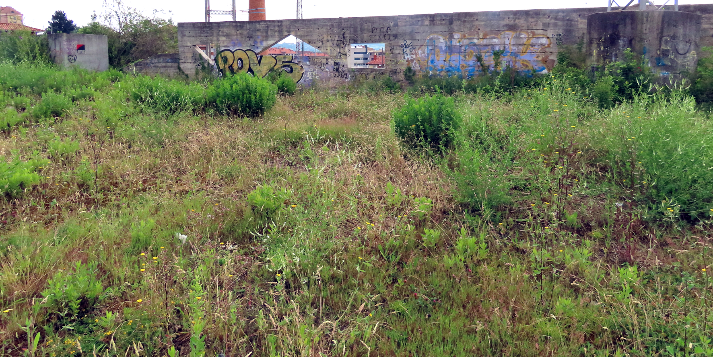

```{r setup, include=FALSE}
knitr::opts_chunk$set(echo = TRUE)
```

[](https://doi.org/10.5281/zenodo.6077618)



# Classification and characterization of anthropogenic plant communities at the ecoregion level

This repository stores all the information related to the manuscript [*Classification and characterization of anthropogenic plant communities at the ecoregion level*](https://github.com/efernandezpascual/manmade/blob/master/doc/manuscript.md), including the datasets, the scripts to perform data cleaning and analysis, and the `Rmarkdown` files to create the manuscript.

## Contents

This repository is organised following the advice of [Wilson et al. 2017](https://doi.org/10.1371/journal.pcbi.1005510) for recording and storing research projects.


The following materials are available in the folders of this repository:

* `data` Data files including the vegetation plots.
* `doc` Files to create the [manuscript](https://github.com/efernandezpascual/manmade/blob/master/doc/manuscript.md) using `Rmarkdown`.
* `results` Output of the `R` scripts, including figures and model outputs.
* `src` Scripts in `R` language used to clean the raw data and perform the analyses of the manuscript.

## Abstract

* *Questions* How can we classify the diversity of anthropogenic plant communities at the ecoregion level? How are these communities characterized by species origins (native plants, archaeophytes, and neophytes), species traits (lifeforms, plant height, and flowering phenology) and ecological preferences (temperature, moisture, light, nutrients, soil reaction, disturbance frequency, and disturbance severity)? 

* *Location* Iberian Atlantic ecoregion (a.k.a. Cantabrian Mixed Forests); Portugal, Spain, and France; south-western Europe.

* *Methods* We compiled a vegetation database of 2,508 synanthropic plots and revised the regional checklist of anthropogenic vegetation alliances. We used modified TWINSPAN and semi-supervised classification to classify the plots into the revised alliances. We determined the proportion of natives, archaeophytes, and neophytes. We also described the alliances in terms of species traits and ecological requirements.

* *Results* We classified 2,081 vegetation plots into 28 anthropogenic alliances representing 9 vegetation classes (*Cymbalario-Parietarietea diffusae*, *Polygono-Poetea annuae*, *Papaveretea rhoeadis*, *Digitario sanguinalis-Eragrostietea minoris*, *Chenopodietea*, *Sisymbrietea*, *Bidentetea*, *Artemisietea vulgaris* and *Epilobietea angustifolii*). The plots included 1,162 plant taxa: 78% natives, 15% archaeophytes, and 7% neophytes. Vegetation groups were organized along a principal axis of variation related to abiotic stress (dry-sunny to moist-shady habitats), and a second axis related to disturbance (low to high disturbance frequency and severity).

* *Conclusions* Ecoregion-level synthesis detected a discrepancy between the number of anthropogenic vegetation units described in the literature (38 alliances) and the number supported by numerical classification (28). The diversity of anthropogenic vegetation can be organized into three groups: trampled, weeds, and ruderals. In the Iberian Atlantic ecoregion, anthropogenic habitats host one third of the ecoregion plant species pool and one fifth of the Iberian flora. Mesic perennial ruderal vegetation is especially rich in native species and can be a biodiversity asset in urban ecosystems. Our ecoregion-level framework can improve the assessment and management of anthropogenic plant communities within biogeographically meaningful regions.

## Citation

Please cite the repository, datasets and article as: 

> Fernández-Pascual E, González-García, Ivesdal G, Lázaro-Lobo A, Jiménez-Alfaro B. [*Classification and characterization of anthropogenic plant communities at the ecoregion level*](https://github.com/efernandezpascual/manmade/blob/master/doc/manuscript.md), *in preparation*.