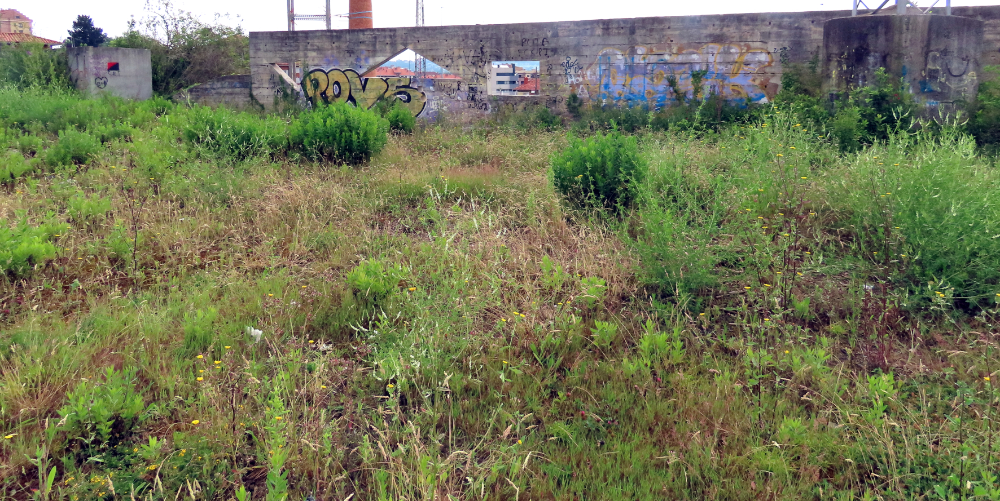

README.md
================

# Classification and characterization of anthropogenic plant communities in the northwestern Iberian Peninsula

This repository stores all the information related to the manuscript
[*Classification and characterization of anthropogenic plant communities
in the northwestern Iberian
Peninsula*](https://github.com/efernandezpascual/manmade/blob/master/doc/manuscript.md),
including the datasets, the scripts to perform data cleaning and
analysis, and the `Rmarkdown` files to create the manuscript.

## Contents

This repository is organised following the advice of [Wilson et
al. 2017](https://doi.org/10.1371/journal.pcbi.1005510) for recording
and storing research projects.

The following materials are available in the folders of this repository:

- `data` Data files including the vegetation plots.
- `doc` Files to create the
  [manuscript](https://github.com/efernandezpascual/manmade/blob/master/doc/manuscript.md)
  using `Rmarkdown`.
- `results` Output of the `R` scripts, including figures and model
  outputs.
- `src` Scripts in `R` language used to clean the raw data and perform
  the analyses of the manuscript.

## Abstract

- *Questions* Can we reconcile regional and European classifications of
  anthropogenic plant communities at the biogeographical scale? How are
  these communities characterized by species origins, traits and
  ecological preferences?

- *Location* Atlantic territories in the NW Iberian Peninsula (a.k.a.
  Cantabrian Mixed Forests ecoregion); south-western Europe.

- *Methods* We classified 2,508 plots with the aim of being consistent
  with regional phytosociological expertise, while matching that
  expertise with current EuroVegChecklist alliances. We used modified
  TWINSPAN to revise the original phytosociological classification,
  followed by semi-supervised re-classification of the whole dataset. We
  determined the proportion of natives, archaeophytes and neophytes. We
  also described the alliances in terms of species traits (lifeforms,
  height and flowering phenology) and ecological requirements
  (temperature, moisture, light, nutrients, soil reaction, disturbance
  frequency and severity).

- *Results* We assigned 2,086 vegetation plots to 25 anthropogenic
  alliances representing 9 vegetation classes (*Cymbalario-Parietarietea
  diffusae*, *Polygono-Poetea annuae*, *Papaveretea rhoeadis*,
  *Digitario sanguinalis-Eragrostietea minoris*, *Chenopodietea*,
  *Sisymbrietea*, *Bidentetea*, *Artemisietea vulgaris* and *Epilobietea
  angustifolii*). The plots included 1,149 species: 78% natives, 15%
  archaeophytes and 7% neophytes. Vegetation groups were organized along
  a principal axis of abiotic stress (dry-sunny to moist-shady habitats)
  and a secondary axis of disturbance.

- *Conclusions* In the Iberian Atlantic territories, anthropogenic
  habitats host one third of the regional plant species pool and one
  fifth of the Iberian flora. Mesic perennial ruderal vegetation is
  especially rich in native species and can be a biodiversity asset in
  urban landscapes. Our biogeographical-level synthesis can improve the
  management of anthropogenic plant communities and contribute towards a
  European-level synthesis of human-made vegetation.

## Citation

Please cite the repository, datasets and article as:

> Fernández-Pascual E, González-García, Ivesdal G, Lázaro-Lobo A,
> Jiménez-Alfaro B. [*Classification and characterization of
> anthropogenic plant communities in the northwestern Iberian
> Peninsula*](https://github.com/efernandezpascual/manmade/blob/master/doc/manuscript.md),
> *in preparation*.
