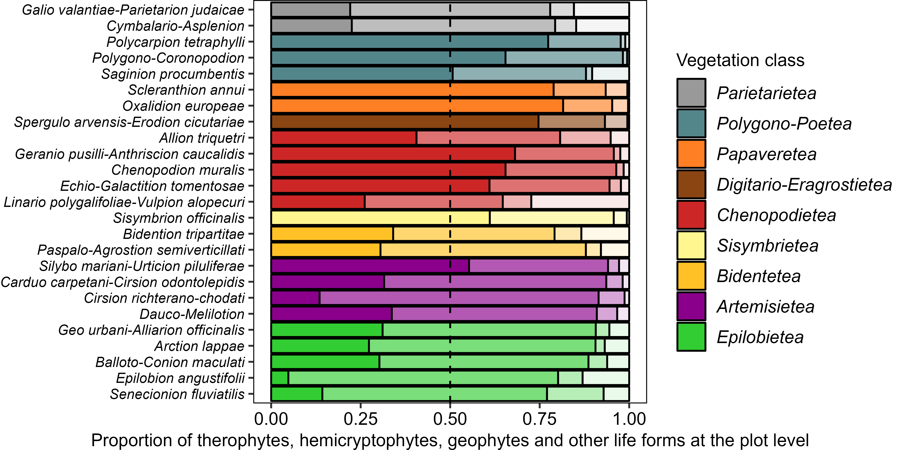
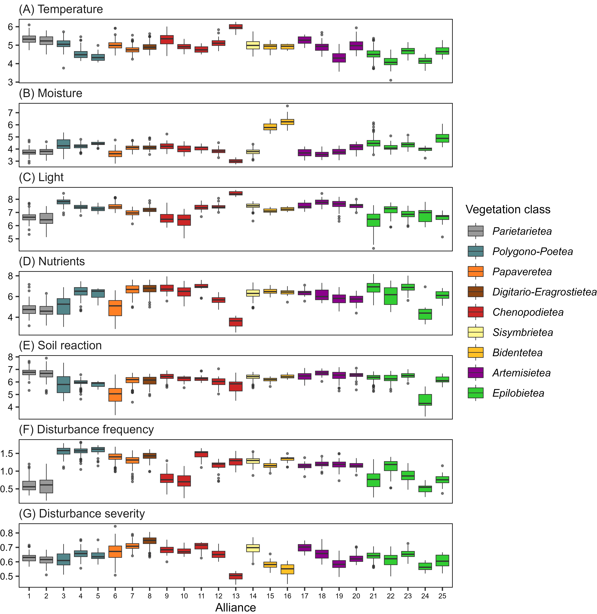
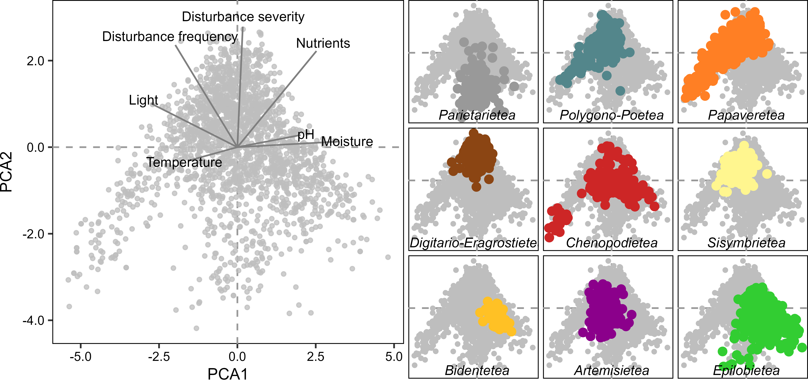

```{r setup, include=FALSE}
knitr::opts_chunk$set(echo = TRUE)
```

```{r message = FALSE, echo = FALSE, warning = FALSE}
knitr::knit_hooks$set(inline = function(x) {
  prettyNum(x, big.mark = ",")
})
```

# Introduction

Anthropogenic vegetation is the set of plant communities that occur as a direct consequence of human activities, and is chiefly composed by the weed vegetation of arable fields and the ruderal vegetation of human settlements and their surroundings [@RN5441]. The anthropogenic communities of human-made habitats make up an important part of the supply of natural elements in urban and peri-urban habitats [@RN5445]. In densely-populated city landscapes, the plant communities that colonize urban vacant lots [@RN2300] are a useful biodiversity resource with high ecological and societal potential [@RN5446]. Anthropogenic vegetation cover can also impact regional-level extreme climatic events [@RN5440]. Furthermore, many synanthropic plants can accumulate heavy metals in their biomass [@RN5433], making them valuable candidates for nature-based solutions such as bioremediation and restoration of degraded landscapes [@RN5447].

The anthropogenic vegetation of temperate Europe is formed by an original pool of native species favored by humans, but this pool has been constantly enriched by the arrival of alien species: first archaeophytes starting in the Neolithic and peaking in the Bronze Age; and then neophytes from the Modern Age (after 1.500 A.D.) to the present day [@RN5439]. Synanthropic archaeophytes include many Mediterranean taxa that started their expansion into temperate areas during the Mid-Holocene warm period, but it is difficult to disentangle to what extent this expansion was favored by human activities and/or ongoing climatic changes [@RN5432; @RN5443], especially in southern European areas close to the transition between the Mediterranean and the temperate climates [@RN5444]. Meanwhile, synanthropic neophytes include many American, African and Asian taxa that arrived as a consequence of the global trade networks established by the Western European colonial powers [@RN5451]. In the last century, anthropogenic vegetation has shown a decrease in species richness and diversity [@RN5423], as rare synanthropic species have become rarer, and neophytes have increased their abundance at the expense of natives and archaeophytes [@RN5441].

Antropogenic vegetation is likely to be similar within ecological regions (ecoregions, hereafter), since they are assumed to encompass areas with a similar biogeographic history and recurrent local ecosystems [@RN5491]. However, ecoregional-scale studies on the diversity of antropogenic vegetation are scarce in the literature. The Iberian Atlantic ecoregion (a.k.a. Cantabrian Mixed Forests ecoregion; NW Iberian Peninsula) has a long history of human habitation dating back to the Cantabrian Upper Paleolithic [@RN5450]. This, together with its transitional position at the border between the temperate and Mediterranean climatic zones of Europe [@RN4700], suggests a long regional history for archaeophyte-rich anthropogenic plant communities, likely supporting a current high diversity of anthropogenic plant communities with both temperate and Mediterranean floristic elements [@RN5008]. Historical trade links with America and Asia, together with the warm and humid temperate climate, have made the region a hotspot for neophyte invasions [@RN5492; @RN5493]. Recent post-industrial land-use changes have left large areas with abandoned industrial sites (i.e. brownfields) whose management and restoration requires an understanding of anthropogenic communities able to colonize or restore them [@RN5448; @RN5449]. Although there is a long tradition of studying weed and ruderal communities in the ecoregion [@RN5364; @RN5361; @RN5359; @RN5360] there is a current need for an ecoregional-level synthesis that revises and updates the classification and updates in accord with recent developments in European vegetation science [@RN4698] and habitat classification [@RN5061]. In this article we have performed such a synthesis with two main objectives: (1) provide an updated classification of anthropogenic plant communities in the Iberian Atlantic ecoregion, and (2) describe the main patterns of vegetation diversity in terms of floristic origin (natives, archaeophytes, neophytes); life forms; functional traits (plant height and flowering time); and ecological indicator values (temperature, moisture, light, nutrients, soil reaction, disturbance frequency and disturbance severity).

# Methods

We performed all data management and analysis with R version 4.3.1 [@RN5387], using the R package *tidyverse* [@RN4662] for data processing and visualization. We homogenized all taxon names in the analysis and the article using Euro+Med [@RN5044] or Plants of the World Online for taxa not in Euro+Med [@RN5376].  For the nomenclature of sintaxa we follow Mucina *et al.* [-@RN4698] for alliances and higher ranks, and Rivas-Martínez *et al.* [-@RN4697] for associations. The original datasets, as well as R code for analysis and creation of the manuscript can be accessed at the GitHub repository <https://github.com/efernandezpascual/manmade>. 

## Study ecoregion

We studied the anthropogenic plant communities of the Iberian Atlantic ecoregion [@RN5372], i.e. the territories with a temperate climate in the north-western Iberian Peninsula. Our study ecoregion broadly corresponds with the Cantabrian Mixed Forests ecoregion *sensu* Olson *et al.* [-@RN4667], with the Iberian part of the European Atlantic province *sensu* Rivas-Martínez *et al.* [-@RN4699] and with the Iberian section of the Atlantic biogeographical region of the European Environmental Agency (<https://www.eea.europa.eu/data-and-maps/figures/biogeographical-regions-in-europe-2>).

## Definition of anthropogenic vegetation

To circumscribe our study vegetation, we followed the definition of anthropogenic vegetation in the recent classification of the vegetation of Europe by Mucina *et al.* [-@RN4698]. In our study area, this potentially includes the vegetation classes *Polygono-Poetea annuae*, *Papaveretea rhoeadis*, *Digitario sanguinalis-Eragrostietea minoris*, *Chenopodietea*, *Sisymbrietea*, *Bidentetea*, *Artemisietea vulgaris* and *Epilobietea angustifolii*. To these, and for a complete synthesis, we added to our study the class *Cymbalario-Parietarietea diffusae* included by Mucina *et al.* [-@RN4698] in the vegetation of rock crevices and screes, since this class encompasses the vegetation of human-made walls.

## Checklist of anthropogenic sintaxa

To assist in our classification, we prepared a checklist of anthropogenic sintaxa that could potentially be present in our study ecoregion (**Supplementary 1**), based on regional sintaxonomical checklists [@RN5363; @RN5008; @RN5365] and recent revisions at the European level [@RN4698; @RN5371]. The checklist inclused 38 anthropogenic vegetation alliances that could be present in the Iberian Atlantic ecoregion (**Supplementary 2**). A goal of our study was to validate the presence of these alliances in our ecoregion, and to assign to them the existing vegetation data. 

## Vegetation data selection

We retrieved anthropogenic vegetation plots from SIVIM, the Iberian and Macaronesian Vegetation Information System [@RN5374]. To identify plots as anthropogenic, we selected those plots that had been classified by the original authors of the plot as belonging to any sintaxa in our sintaxonomical checklist. However, since not all plots in SIVIM have an assigned sintaxon, we also retrieved additional plots using the expert system created by Chytrý *et al.* [-@RN5061] to classify vegetation plots into EUNIS pan-European habitat types. This expert system uses the floristic composition of plots to assign them to habitat types depending on the presence and abundance of characteristic species. We retrieved plots that had been assigned to any habitat related to the vegetation classes we had previously defined: all habitats in the level 1 code V (vegetated man-made habitats), plus level 3 codes R55 (lowland moist or wet tall-herb and fern fringe) and R57 (herbaceous forest clearing vegetation). It must be noted that habitats R55 and R57 include communities that are classified as *grasslands and lands dominated by forbs, mosses or lichens * by EUNIS but as *anthropogenic vegetation* by by Mucina *et al.* [-@RN4698]. The extraction from SIVIM produced an initial pool of 3,160 vegetation plots, to which we added 89 vegetation plots of urban or peri-urban plant communities sampled by us or extracted from local literature not in SIVIM [@RN5377; @RN5378]. 

## Vegetation data cleaning

We performed an exploratory analysis of these 3,249 plots using Two-Way Indicator Species Analysis (TWINSPAN) [@RN5379]. We used the R package *twinspanR* [@RN5380] to do the TWINSPANs in this article, using 3 pseudospecies cut levels (0, 15, 25) with a minimum group size of 10 plots and Sørensen's average dissimilarity. During this exploratory analysis we identified 741 outlier plots which either did not belong to the target anthropogenic vegetation or to the geographical area of the ecoregion. The majority of these plots corresponded to coastal plant communities and had been misclassified by the expert system. We removed these, leaving a dataset of 2,508 vegetation plots for data analysis: 2,419 plots from SIVIM, originally recorded in 89 publications (**Supplementary 3**); plus 89 plots added by us.

## Training dataset for semi-supervised classification and validation of alliances

To create a training dataset for semi-supervised classification (see below), we started by keeping only those plots (n = 2,201) that had been assigned by the original authors of the plot as belonging to any of the 38 alliances in our sintaxonomical checklist (i.e., we removed the plots without sintaxa, that had been retrieved solely by the expert system). We further cleaned this subset by subjecting it to a preliminary numerical classification using TWINSPAN, in which we attempted to match the plots into the 38 alliances our sintaxonomical checklist. This step allowed us to identify those plots in which there was an agreement between (1) our TWINSPAN-based classification and (2) the classification based on the original-author sintaxa; these plots (n = 1,725) became our training dataset for semi-supervised classification. Furthermore, this step allowed us to validate which alliances from our sintaxonomical checklist were present in the study ecoregion (n = 28) and which were absent (n = 10).

## Semi-supervised classification

Next, we conducted a semi-supervised classification of the whole dataset (n = 2,508 plots) into the 28 validated anthropogenic alliances. Semi-supervised classification uses a training subset of *a priori* classified vegetation plots to classify a secondary subset of unclassified plots [@RN5383]. Since our goal was to refine the classification of the whole dataset, we allowed plots from the training subset to be re-assigned to other alliances during the classification. In addition, semi-supervised classification can create new groups to place data points that do not match the already existing *a priori* groups, but attempts to do so resulted in new groups with no ecological significance, and thus we kept the  28 alliances as final vegetation groups. Furthermore, we applied a noise clustering fuzzy algorithm, which allows the plots to be classified either into the *a priori* alliances or into a *noise* group which includes outliers and transitional plots [@RN5382]. We set the fuzziness coefficient to a low value (m = 1) to accommodate a high number of transitional plots; and we set the distance to the noise class to d = 1. We performed this analysis with the R package *vegclust* [@RN5383]. The semi-supervised classification with noise clustering resulted in the final classification of 2,081 plots into 28 alliances and 427 plots left out in the noise group. We used pairwise PERMANOVA (with 100,000 iterations, Euclidean distances and Holm's p-value correction) fitted with the R package *RVAideMemoire* [@RN5381] to test the significance of the final vegetation alliances; along with Principal Component Analysis (PCA) as implemented in the R package *FactoMineR* [@RN3166] to visualize the relationships between the alliances.

## Characteristic species and EUNIS habitat regionalization

We calculated sets of characteristic species [@RN5061] for each of the final 28 vegetation alliances. We defined dominant species as species with more than 25% cover in at least 5% of the vegetation plots of the group; constant species as species with a frequency higher than 50% in the group; and diagnostic species as species with an *IndVal* value with a p-value lower than 0.05, as calculated with the R package *labdsv* [@RN2311] using 1.000.000 iterations. Additionally, we assigned to each alliance a regionalized level 4 EUNIS habitat code, using pre-existing codes when they existed (<https://eunis.eea.europa.eu/habitats-code-browser-revised.jsp>), and creating new codes when not.

## Species origin as native, archaeophyte and neophyte

We classified the species as native, archaophytes and neophytes using the information in *Flora iberica* [-@RN3243] and catalogues of archaeophytes for Britain [@RN5490] and the Czech Republic [@RN5495]. We must stress that identifying archaeophytes is southern Europe is highly problematic and our classification must be taken as an indication of putative archaeophyte character for the purposes of vegetation description, rather than a definitive classification of the species. 

## Species life form

From *FloraVeg.EU* [-@RN5385] we extracted the species’ life forms and kept *therophyte* and *geophyte* for further analysis since these two categories had the largest contribution to variance as per an exploratory Principal Component Analysis (PCA) performed using the R package *FactoMineR* [@RN3166]. 

## Species and vegetation height and flowering phenology

From *Flora iberica* [-@RN3243] we extracted the maximum height, median month of flowering and length of the flowering period of each species in the dataset. We used these to calculate plot-level community-weighted means (weighting by species cover) for each trait, to characterize the vegetation height and flowering phenology of the anthropogenic plant communities.

## Species ecological indicator values

We collected, for each species in the dataset, its ecological indicator values of temperature, moisture, light, nutrients and soil reaction [@RN5384]; and its disturbance frequency and severity indicator values [@RN5101]. To those species lacking an indicator value in the accessed references, we assigned a value by reciprocal averaging, i.e. by (1) calculating weighted average values of the species with values for each plot (weighting by species cover), and (2) assigning to the missing species the weighted average values of the plots where they were present (weighting by species cover). Then, for each vegetation plot, we calculated the plot-level mean of each indicator value.

# Results

## Overview of the classification

The semi-supervised classification resulted in the classification of 2,081 vegetation plots into 28 anthropogenic alliances of the Iberian Atlantic ecoregion (**Table 1**, **Figure 1**). Most of the alliances had a wide distribution in the ecoregion according to our dataset, although five of them (*Caucalidion lappulae*, *Linario polygalifoliae-Vulpion alopecuri*, *Convolvulo arvensis-Agropyrion repentis*, *Senecionion fluviatilis*, *Paspalo-Agrostion semiverticillati*) had only isolated occurrences in a few points towards the southern limit of the Iberian Atlantic territories. The regional literature included in our dataset recognized 72 associations (**Supplementary 4**) within these alliances. 

Focusing on the classified plots, the dataset included 1,167 taxa or taxa aggregates. Of these, 101 were neophytes (i.e. 9% of the species pool). Regarding life forms, the species pool was dominated by hemicryptophytes (43%) and therophytes (41%). The 10 most frequent species were *Ochlopoa annua* (621 occurrences), *Urtica dioica* (592), *Sonchus oleraceus* (540), *Stellaria media* (516), *Capsella bursa-pastoris* (390), *Polygonum aviculare* (375), *Dactylis glomerata* (363), *Senecio vulgaris* (332) and *Anisantha sterilis* (301). Considering only those plots with the most frequent plot size (20 m^2^, n = 256 plots), the average species richness per plot was 16 (minimum = 3, maximum = 37).

DCA ordination of the floristic composition of the classified plots (**Fig. 2**) suggested a high consistency of the vegetation classes *Cymbalario-Parietarietea diffusae*, *Polygono-Poetea annuae*, *Papaveretea rhoeadis*, *Digitario sanguinalis-Eragrostietea minoris*, *Sisymbrietea* and *Bidentetea*. The alliances belonging to the two perennial ruderal vegetation classes (*Artemisietea vulgaris* and *Epilobietea angustifolii*) were mixed together. The winter-annual class *Chenopodietea* also showed high heterogeneity, especially because of the isolation of the altered dune alliance *Linario polygalifoliae-Vulpion alopecuri*.

## Community-level traits and ecological preferences

PCA ordination of the community-weighted means of the species traits (**Fig. 3A**) indicated that the first two axes explained 65% of the variability. The major contributors to axis 1 (41% variance explained) were community height, proportion of geophytes, mean month of flowering and proportion of therophytes; it separated taller communities with more geophytes and later flowering (classes *Artemisietea vulgaris*, *Epilobietea angustifolii* and *Bidentetea*) from shorter communities with more therophytes and earlier flowering (classes *Polygono-Poetea annuae*, *Papaveretea rhoeadis* and *Sisymbrietea*). The major contributors to axis 2 (24% variance explained) were proportion of neophytes and width of the flowering season; it separated communities with more neophytes and longer flowering seasons (classes *Bidentetea*, *Digitario sanguinalis-Eragrostietea minoris* and *Polygono-Poetea annuae*) from communities with less neophytes and shorter flowering seasons (classes *Artemisietea vulgaris*, *Epilobietea angustifolii* and *Chenopodietea*).

PCA ordination of the community-weighted means of the species ecological and disturbance preferences (**Fig. 3B**) indicated that the first two axes explained 56% of the variability. The major contributors to axis 1 (35% variance explained) were disturbance frequency, soil disturbance, mowing frequency and light requirements; it separated communities thriving with frequent disturbances in open situations (classes *Polygono-Poetea annuae*, *Sisymbrietea*, *Digitario-Eragrostietea* and *Papaveretea rhoeadis*) from communities preferring less frequent disturbances and shadier areas (classes *Cymbalario-Parietarietea diffusae*, *Epilobietea angustifolii* and *Bidentetea*). The major contributors to axis 2 (21% variance explained) were nutrient requirements and disturbance severity; it separated more nitrophilous communities adapted to more severe disturbances (classes *Digitario-Eragrostietea*, *Sisymbrietea* and *Epilobietea angustifolii*) from less nitrophilous communities adapted to lower intensity disturbances (classes *Cymbalario-Parietarietea diffusae*, *Artemisietea vulgaris* and *Chenopodietea*).

## Classified anthropogenic plant communities

***Cymbalario-Parietarietea diffusae*** Vegetation of human-made walls.

1.  *Galio valantiae-Parietarion judaicae* Vegetation of dry walls. Occupies warmer, drier and more nutrient-rich situations than the other alliance in the class, has a shorter flowering season and is more adapted to disturbances (**Fig. 4**). Wide distribution in the ecoregion (**Fig. 1**). Diagnostic species (**Supplementary 5**): *Parietaria judaica* aggr., *Centranthus ruber*, *Asplenium trichomanes*.

2.  *Cymbalario-Asplenion* Vegetation of mesic walls. Occupies colder, wetter and less nutrient-rich situations than the other alliance in the class, has a longer flowering season and is less adapted to disturbances (**Fig. 4**). Wide distribution in the ecoregion (**Fig. 1**). Diagnostic species (**Supplementary 5**): *Cymbalaria muralis*.

***Polygono-Poetea annuae*** Dwarf vegetation of heavily-trampled sites.

3.  *Polycarpion tetraphylli* Dwarf-annual trampled vegetation of warm and sunny sites. Occupies warmer, sunnier and less nutrient-rich situations than the other alliances in the class and has an earlier flowering season (**Fig. 4**). Wide distribution in the ecoregion, specially along the coast and in the more Mediterranean valleys of the interior (**Fig. 1**). Diagnostic species (**Supplementary 5**): *Sagina apetala*, *Plantago coronopus*, *Crassula tillaea*, *Spergularia marina*.

4.  *Polygono-Coronopodion* Dwarf-annual trampled vegetation of dry sites. Occupies colder, drier and more nutrient-rich situations than the other alliances in the class, and has a higher proportion of neophytes (**Fig. 4**). Wide distribution in the ecoregion (**Fig. 1**). Diagnostic species (**Supplementary 5**): *Matricaria suaveolens*, *Polygonum aviculare*.

5.  *Saginion procumbentis* Dwarf trampled vegetation of mesic sites. Occupies colder, wetter and more nutrient-rich situations than the other alliance in the class, and is less dominated by therophytes (**Fig. 4**). Distribution concentrated in the central part of the ecoregion (**Fig. 1**). Diagnostic species (**Supplementary 5**): *Sagina procumbens*, *Bryum argenteum*.

***Papaveretea rhoeadis*** Annual weed vegetation of crops and gardens.

6.  *Caucalidion lappulae* Annual weed vegetation of cereal crops on base-rich soils. Adapted to more frequent and severe disturbances than the other alliances in the class (**Fig. 4**). Distribution mostly limited to the more Mediterranean valleys south of the Cantabrian Mountains (**Fig. 1**). Diagnostic species (**Supplementary 5**): *Cyanus segetum*, *Papaver rhoeas*, *Trifolium arvense*, *Anacyclus clavatus*, *Valerianella eriocarpa*.

7.  *Scleranthion annui* Annual weed vegetation of cereal crops on base-poor soils. Occupies more acidic soils than the other alliances in the class, and flowers earlier (**Fig. 4**). Wide distribution in the ecoregion, but specially in the west, where acidic bedrocks dominate (**Fig. 1**). Diagnostic species (**Supplementary 5**): *Mibora minima*, *Rumex acetosella*.

8.  *Oxalidion europeae* Annual weed vegetation of gardens and root crops. Occupies wetter, shadier and more nutrient-rich situations than the other alliances in the class, has a longer flowering season and a higher proportion of neophytes (**Fig. 4**). Wide distribution in the ecoregion (**Fig. 1**). Diagnostic species (**Supplementary 5**): *Stellaria media*, *Veronica persica*.

***Digitario sanguinalis-Eragrostietea minoris*** Summer-annual C4 weed vegetation.

9.  *Spergulo arvensis-Erodion cicutariae* Summer-annual C4 weed vegetation. Late-flowering alliance rich in neophytes and grasses, occurring in highly-disturbed and nutrient-rich soils (**Fig. 4**). Wide distribution in the ecoregion (**Fig. 1**). Diagnostic species (**Supplementary 5**): *Digitaria sanguinalis*, *Echinochloa crus-galli*, *Chenopodium album*, *Amaranthus hybridus* aggr.

***Chenopodietea*** Winter-annual ruderal vegetation.

10. *Allion triquetri* Geophyte-rich fringe vegetation. Occupies warmer and shadier situations than the other alliances in the class, has a higher proportion of geophytes and a lower proportion of therophytes, and is adapted to less frequent disturbances (**Fig. 4**). Wide distribution in the ecoregion (**Fig. 1**). Diagnostic species (**Supplementary 5**): *Urtica membranacea*, *Smyrnium olusatrum*, *Tradescantia fluminensis*.

11. *Geranio pusilli-Anthriscion caucalidis* Winter-annual fringe vegetation. Occupies situations similar to the previous alliance, but in colder sites, and is dominated by therophytes instead of geophytes (**Fig. 4**). Mostly distributed in the more Mediterranean valleys south of the Cantabrian Mountains (**Fig. 1**). Diagnostic species (**Supplementary 5**): *Geranium lucidum*, *Anthriscus caucalis*.

12. *Chenopodion muralis* Low-growth winter-annual ruderal vegetation. Occupies colder situations than the other alliances in the class and more often disturbed sites, and has a longer and later flowering season (**Fig. 4**). Sparse occurrence throughout the ecoregion (**Fig. 1**). Diagnostic species (**Supplementary 5**): *Malva neglecta*, *Urtica urens*.

13. *Echio-Galactition tomentosae* Tall-herb winter-annual ruderal vegetation. Occupies drier, sunnier and less nutrient-rich situations than the other alliances in the class (**Fig. 4**). Mostly distributed in the west of the ecoregion (**Fig. 1**). Diagnostic species (**Supplementary 5**): *Galactites tomentosus*, *Coleostephus myconis*, *Anisantha rigida*.

14. *Linario polygalifoliae-Vulpion alopecuri* Ephemeral annual vegetation of disturbed coastal dunes. Occupies drier and more nutrient-poor situations than the other alliances in the class (**Fig. 4**) and has a high number of coastal dune species. Isolated occurrence in the southern coasts of the ecoregion (**Fig. 1**). Diagnostic species (**Supplementary 5**): *Vulpia alopecuros*, *Malcolmia littorea*, *Crucianella maritima*, *Artemisia campestris* aggr.

***Sisymbrietea*** Summer-annual ruderal vegetation.

15. *Sisymbrion officinalis* Summer-annual ruderal vegetation. Rich in therophytes and adapted to severe disturbances (**Fig. 4**). Wide distribution in the ecoregion (**Fig. 1**). Diagnostic species (**Supplementary 5**): *Hordeum murinum*, *Sisymbrium officinale*.

***Bidentetea*** Summer-annual pioneer vegetation of temporarily-flooded sites.

16. *Bidention tripartitae* Summer-annual pioneer vegetation of temporarily-flooded sites. Occupies nutrient-richer sites than the other alliance in the class and has a higher proportion of therophytes (**Fig. 4**). Dispersed throughout the ecoregion (**Fig. 1**). Diagnostic species (**Supplementary 5**): *Persicaria hydropiper*, *Bidens frondosus*, *Lythrum salicaria*.

17. *Paspalo-Agrostion semiverticillati* Summer-annual pioneer vegetation of temporarily-flooded and warm sites. Occupies warmer and wetter situations than the other alliance in the class, has a higher proportion of neophytes and has a longer flowering season (**Fig. 4**). Isolated occurrences in the south of the ecoregion (**Fig. 1**). Diagnostic species (**Supplementary 5**): *Paspalum distichum*, *Cyperus longus*, *Schoenoplectus lacustris*.

***Artemisietea vulgaris*** Perennial ruderal vegetation of dry sites.

18. *Convolvulo arvensis-Agropyrion repentis* Semiruderal grasslands. Occupies wetter and shadier situations than the other alliances in the class, and has a higher proportion of geophytes and grasses (**Fig. 4**). Isolated occurrence in the south of the ecoregion (**Fig. 1**). Diagnostic species (**Supplementary 5**): *Poa compressa*, *Elytrigia repens*, *Potentilla reptans*, *Valerianella locusta*.

19. *Carduo carpetani-Cirsion odontolepidis* Thistle ruderal vegetation of warm sites. Occupies warmer situations than the other thistle alliance in the class (**Fig. 4**). Mostly distributed in the Cantabrian Mountains (**Fig. 1**). Diagnostic species (**Supplementary 5**): *Onopordum acanthium*.

20. *Cirsion richterano-chodati* Thistle ruderal vegetation of cold sites. Occupies colder situations than the other thistle alliance in the class (**Fig. 4**). Mostly distributed in the Cantabrian Mountains (**Fig. 1**). Diagnostic species (**Supplementary 5**): *Cirsium eriophorum*, *Carduus carpetanus*, *Carduus nutans* aggr.

21. *Dauco-Melilotion* Biennial ruderal vegetation. Occupies wetter situations than the two thistle alliances in the class, and has a higher proportion of therophytes (**Fig. 4**). Sparse occurrence throughout the ecoregion (**Fig. 1**). Diagnostic species (**Supplementary 5**): *Helminthotheca echioides*, *Daucus carota*, *Melilotus albus*, *Foeniculum vulgare*.

***Epilobietea angustifolii*** Perennial ruderal vegetation of mesic to wet sites.

22. *Geo urbani-Alliarion officinalis* Low-herb short-lived semiruderal and fringe vegetation. Occupies shadier and less disturbed situations than the other alliances in the class, and has a higher proportion of therophytes and shorter plants (**Fig. 4**). Wide distribution in the ecoregion (**Fig. 1**). Diagnostic species (**Supplementary 5**): *Urtica dioica*.

23. *Arction lappae* Low-herb short-lived ruderal vegetation. Occupies sunnier and more frequently-disturbed situations than the other alliances in the class, and has a higher proportion of therophytes and shorter plants (**Fig. 4**). Distribution concentrated in the Cantabrian Mountains (**Fig. 1**). Diagnostic species (**Supplementary 5**): *Oxybasis rubra*, *Senecio duriaei*.

24. *Balloto-Conion maculati* Tall-herb perennial ruderal vegetation. Occupies warmer situations than the other alliances in the class (**Fig. 4**). Distribution concentrated in the Cantabrian Mountains and the east of the ecoregion (**Fig. 1**). Diagnostic species (**Supplementary 5**): *Sambucus ebulus*.

25. *Aegopodion podagrariae* Tall-herb perennial vegetation of forest margins and clearings. Occupies shadier and less disturbed situations than the other alliances in the class (**Fig. 4**). Sparse occurrence throughout the ecoregion (**Fig. 1**). Diagnostic species (**Supplementary 5**): *Anthriscus sylvestris*, *Heracleum sphondylium*, *Galium aparine*.

26. *Epilobion angustifolii* Tall-herb perennial vegetation of forest margins and clearings in acidic soils. Occupies colder, nutrient-poorer, more acidic and less disturbed situations than the other alliances in the class (**Fig. 4**). Distributed towards the west of the ecoregion (**Fig. 1**). Diagnostic species (**Supplementary 5**): *Epilobium angustifolium*, *Digitalis purpurea*, *Luzula lactea*.

27. *Cynancho-Convolvulion sepium* Tall-herb vegetation of nutrient-rich riparian habitats. Occupies wetter situations and less disturbed situations than the other alliances in the class, and has a later flowering season (**Fig. 4**). Dispersed throughout the ecoregion (**Fig. 1**). Diagnostic species (**Supplementary 5**): *Eupatorium cannabinum*, *Angelica sylvestris*, *Picris hieracioides*.

28. *Senecionion fluviatilis* Tall-herb vegetation of nutrient-rich river banks and ditches. Occupies warmer and wetter situations than the other alliances in the class, flowers later, has taller plants and is highly dominated by neophytes and geophytes (**Fig. 4**). Isolated occurrence in the western coast of the ecoregion (**Fig. 1**). Diagnostic species (**Supplementary 5**): *Arundo donax*, *Silene latifolia*.

# Discussion

The major driver of variation in trampled community composition is soil moisture [@RN5434].

In medieval Switzerland, summer and winter weeds communities could not be distinguished [@RN5431].

The class *Digitario sanguinalis-Eragrostietea minoris* includes thermophilic vegetation dominated by C4 plants that occupies arable land as well as trampled and ruderal sites [@RN5426].

Anthropogenic vegetation composition is sensitive to micro-scale management decisions, such as the ownership of domestic dogs [@RN5438].

Neophytes were more represented in early successional anthropogenic communities [@RN5423].

Arable land plants were mainly therophytes and alien species; while ruderal habitats were richer in perennials and C strategists [@RN5436].

Compare proportion of neophytes to other areas [@RN5429; \@ @RN5435]

Neophytes have no special preferences for local habitat conditions and their highest proportion was found mainly in disturbed habitats at low elevations. [@RN5435]

Therophytes and hemicryptophytes were most abundant in the life form spectra [@RN5428]

Segetal vegetation of Palestine [@RN5494].

History of synanthropic veg in czech [@RN5496]

# Data availability

The original datasets, as well as R code for analysis and creation of the manuscript can be accessed at the GitHub repository <https://github.com/efernandezpascual/manmade>. Upon publication, a version of record of the repository will be deposited in Zenodo.

# References

::: {#refs}
:::

# Figures

```{r fig1, echo = FALSE, fig.pos = "H", fig.cap = "Figure 1. Anthropogenic vegetation alliances of the Iberian Atlantic ecoregion. Each dot is a vegetation plot. Dot colors indicate the vegetation class."}
knitr::include_graphics("../results/figures/F1 - maps.png")
```

```{r fig2, echo = FALSE, fig.pos = "H", fig.cap = "Figure 2. Floristic composition of the anthropogenic plant communities of the Iberian Atlantic ecoregion. Biplots produced by Principal Component Analysis (PCA) with Hellinger transformation. PCAs were conducted for the whole vegetation (A) and for specific subsets (B-F). Colors indicate the vegetation class."}
knitr::include_graphics("../results/figures/F2 - pca.png")
```

```{r fig3, echo = FALSE, fig.pos = "H", fig.cap = "Figure 3. Proportion of neophytes, archaeophytes and native species in the anthropogenic plant communities of the Iberian Atlantic ecoregion. Each bar represents the plot-level average proportion of neophytes (dark shade), archaeophytes (medium shade) and natives (light shade) in each vegetation alliance. Colors indicate the vegetation class."}
knitr::include_graphics("../results/figures/F3 - origins.png")
```

```{r fig4, echo = FALSE, fig.pos = "H", fig.cap = "Figure 4. Proportion of therophytes, geophytes and other life forms in the anthropogenic plant communities of the Iberian Atlantic ecoregion. Each bar represents the plot-level average proportion of therophytes (dark shade), geophytes (medium shade) and other life forms (light shade) in each vegetation alliance. Colors indicate the vegetation class."}

```

```{r fig5, echo = FALSE, fig.pos = "H", fig.cap = "Figure 5. Vegetation heigh and flowering phenology of the anthropogenic plant communities of the Iberian Atlantic ecoregion. Boxplots show the community-weighted mean for plant heigh, month of peak flowering and length of the flowering season for each vegetation alliance. Colors indicate the vegetation class."}
knitr::include_graphics("../results/figures/F5 - height-flowering.png")
```

```{r fig6, echo = FALSE, fig.pos = "H", fig.cap = "Figure 6. Ecological requirements of the anthropogenic plant communities of the Iberian Atlantic ecoregion. Boxplots show the plot-level means for the ecological indicator values of temperature, moisture, light, nutrients, soil reaction, disturbance frequency and disturbance severity, calculated for each vegetation alliance. Colors indicate the vegetation class."}

```

```{r fig7, echo = FALSE, fig.pos = "H", fig.cap = "Figure 7. Pattern of variation in the ecological requirements of the anthropogenic plant communities of the Iberian Atlantic ecoregion. Biplot produced by Principal Component Analysis (PCA) of the plot-level means for the ecological indicator values of temperature, moisture, light, nutrients, soil reaction, disturbance frequency and disturbance severity. Labels and arrows indicate the contribution of each indicator to the first and second principal components. Colors indicate the vegetation class."}

```
