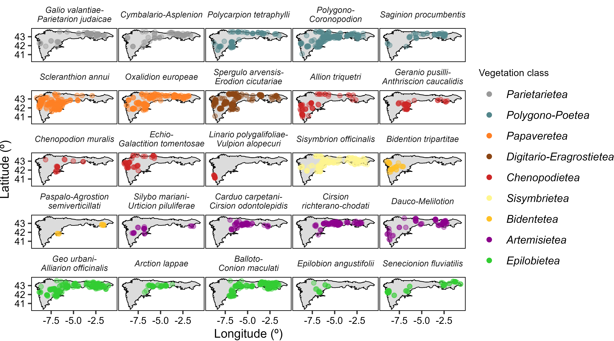
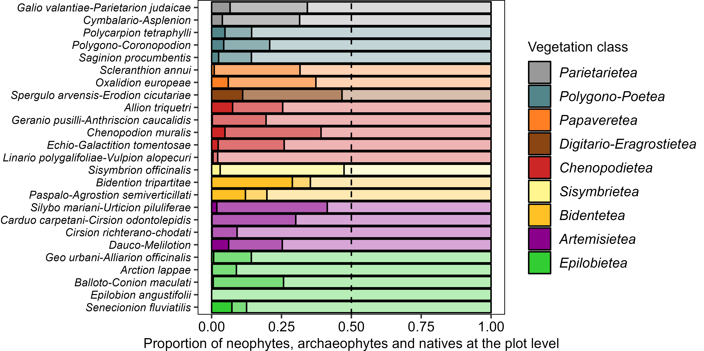

```{r setup, include=FALSE}
knitr::opts_chunk$set(echo = TRUE)
```

```{r message = FALSE, echo = FALSE, warning = FALSE}
knitr::knit_hooks$set(inline = function(x) {
  prettyNum(x, big.mark = ",")
})
```

# Abstract (300 words max.)

* *Questions* Can we reconcile regional and European classifications of anthropogenic plant communities at the biogeographical scale? How are these communities characterized by species origins, traits and ecological preferences?

* *Location* Atlantic territories in the NW Iberian Peninsula (a.k.a. Cantabrian Mixed Forests ecoregion); south-western Europe.

* *Methods* We classified 2,508 plots with the aim of being consistent with regional phytosociological expertise, while matching that expertise with current EuroVegChecklist alliances. We used modified TWINSPAN to revise the original phytosociological classification, followed by semi-supervised re-classification of the whole dataset. We determined the proportion of natives, archaeophytes and neophytes. We also described the alliances in terms of species traits (lifeforms, height and flowering phenology) and ecological requirements (temperature, moisture, light, nutrients, soil reaction, disturbance frequency and severity).

* *Results* We assigned 2,086 vegetation plots to 25 anthropogenic alliances representing 9 vegetation classes (*Cymbalario-Parietarietea diffusae*, *Polygono-Poetea annuae*, *Papaveretea rhoeadis*, *Digitario sanguinalis-Eragrostietea minoris*, *Chenopodietea*, *Sisymbrietea*, *Bidentetea*, *Artemisietea vulgaris* and *Epilobietea angustifolii*). The plots included 1,149 species: 78% natives, 15% archaeophytes and 7% neophytes. Vegetation groups were organized along a principal axis of abiotic stress (dry-sunny to moist-shady habitats) and a secondary axis of disturbance.

* *Conclusions* In the Iberian Atlantic territories, anthropogenic habitats host one third of the regional plant species pool and one fifth of the Iberian flora. Mesic perennial ruderal vegetation is especially rich in native species and can be a biodiversity asset in urban landscapes. Our biogeographical-level synthesis can improve the management of anthropogenic plant communities and contribute towards a European-level synthesis of human-made vegetation.

# Keywords (10 max)

Synanthropic vegetation, manmade habitats, human-made habitats, urban biodiversity, neophytes, archaeophytes, alien plants, habitat classification, semi-supervised classification, Cantabrian Mixed Forests

# Introduction

Anthropogenic vegetation is the sum of plant communities assembled as a direct consequence of human activities. In general, this vegetation is composed of the so-called weeds of arable fields and the ruderal plants growing on human settlements and nearby habitats [@RN5441]. In densely populated landscapes, the anthropogenic communities that colonize vacant lots [@RN2300] are a useful natural resource with high ecological and societal potential [@RN5446; @RN5445]. Anthropogenic vegetation can also mitigate regional-level extreme climatic events [@RN5440]. Furthermore, many synanthropic plants are adapted to disturbance and can accumulate heavy metals in their biomass [@RN5433], making them valuable candidates for nature-based solutions such as bioremediation and restoration of degraded post-industrial landscapes [@RN5447]. 

In temperate Europe, anthropogenic vegetation is a melting pot of floras from different biogeographical origins. The starting native pool of species favored by humans has been constantly enriched by human-assisted arrival of alien (i.e. non-native) species [@RN5504]. The introduction of archaeophytes (i.e. alien species arriving before 1.500 CE) likely started in the early Neolithic and peaked in the Bronze Age, with successive waves during periods of accelerated human colonization such as the early Middle Ages [@RN5504]. In Europe, synanthropic archaeophytes include many Mediterranean taxa originating from the segetal flora of the Near East [@RN5494]. Some of these archaeophytes are 'obligate weeds' that do not occur in non-anthropogenic habitats and are assumed to have evolved together with human agriculture [@RN5494]. The synanthropic flora of Europe has been further enriched by neophytes, alien taxa that arrived after the expansion of intercontinental trade in the Modern Age (after 1.500 CE) [@RN5439; @RN5451]. In the last century, the European anthropogenic vegetation has shown a decrease in species richness and diversity [@RN5423], as rare synanthropic species have become rarer and neophytes have increased their abundance at the expense of natives and archaeophytes [@RN5441].

Despite the potential of anthropogenic vegetation as a biodiversity asset in human-made landscapes and its ecological interest as an assemblage of species pools from different biogeographical origins, human-made vegetation is largely absent from ecosystem management. A comprehensive management will require a solid definition, classification and description of anthropogenic plant communities. However, the classification of anthropogenic vegetation is subject to particularities making it a special case compared to the classification of non-anthropogenic communities. In human-made habitats, the traditional understanding of community assembly based on sequential filtering (dispersal, abiotic and biotic) must incorporate an additional filtering based on human preferences and actions [@RN5505]. Human landscapes are a mosaic of land uses [@RN5527], having specific effects on plant community assembly and driven by sociological rather than traditional ecological factors [@RN2300]. Another issue is defining anthropogenic vegetation, especially in a continent such as Europe where human impact on the landscape has been widespread since ancient times. The two major vegetation/habitat classifications coexisting in Europe today, phytosociological classification [@RN4698] and the EUNIS habitat classification [@RN5061], have not fully equivalent definitions of which plant communities fall within their ‘anthropogenic’ or ‘manmade’ categories. These issues are further muddled by the fact that most classification studies of anthropogenic vegetation have focused either on a restricted political unit [@RN5424; @RN5426] or in a subset of the vegetation, such as segetal [@RN5494], ruderal [@RN5422] or trampled [@RN5434] vegetation. There is a need for a numerical classification and synthesis of the full spectrum of anthropogenic vegetation, focusing on coherent biogeographical units, i.e. areas with a similar bioclimate, a shared biogeographic history and recurrent local ecosystems [@RN5491]. 

The Atlantic territories in the NW Iberian Peninsula (a.k.a. Cantabrian Mixed Forests ecoregion) have a long history of human habitation dating back to the Cantabrian Upper Paleolithic [@RN5450]. This, together with their transitional position at the border between the temperate and Mediterranean climatic zones of Europe, suggests a long regional history for archaeophyte-rich anthropogenic plant communities, supporting the current diverse anthropogenic vegetation with both temperate and Mediterranean floristic elements [@RN5008]. Moreover, historical trade links with America and Asia, together with the warm and humid temperate climate, have made the region a hotspot for biological invasions [@RN5492; @RN5493]. Recent post-industrial land-use changes have left large areas with abandoned industrial sites (i.e. brownfields) whose management and restoration requires an understanding of the anthropogenic communities able to colonize them [@RN5448; @RN5449]. Although there is a long tradition of studying weed and ruderal communities within the area [@RN5364; @RN5361; @RN5359; @RN5360; @RN5589; @RN5590; @RN5591] there is a current need for a biogeographical-level synthesis that revises and updates the classification in accord with recent developments in European vegetation science [@RN4698] and habitat classification [@RN5061]. In this article, we have performed such a synthesis with the following two objectives: (1) to provide an updated classification at the alliance level of anthropogenic plant communities in the Iberian Atlantic territories; and (2) to characterize the diversity of anthropogenic vegetation in terms of species pools (natives, archaeophytes, neophytes); species traits (life form, plant height, flowering phenology); and ecological requirements (temperature, moisture, light, nutrients, soil reaction, disturbance frequency and disturbance severity).

# Methods

## Data curation and taxonomic criteria

We performed all data management and analysis with R version 4.3.1 [@RN5387], using the R package *tidyverse* [@RN4662] for data processing and visualization. We homogenized all taxon names using Euro+Med [@RN5044] or Plants of the World Online [@RN5376] for taxa not in Euro+Med. For the nomenclature of syntaxa, we followed Mucina *et al.* [-@RN4698] for alliances and higher ranks and Rivas-Martínez *et al.* [-@RN4697] for associations. The original datasets, as well as R code for analysis and creation of the manuscript, are stored in a GitHub repository available at Zenodo (see 'Data availability statement').

## Biogeographical territory under study

We studied the anthropogenic plant communities of the Iberian Atlantic territories, a biogeographical unit defined by Fernández Prieto *et al.* [-@RN5372; -@RN5588] as the territories with a temperate climate in the north-western part of the Iberian Peninsula (NW Portugal, N Spain, SW France). Our study area follows the detailed borders provided by Fernández Prieto *et al.* [-@RN5372; -@RN5588] and is broadly equivalent to the Cantabrian Mixed Forests ecoregion *sensu* Olson *et al.* [-@RN4667], to the Iberian part of the European Atlantic province *sensu* Rivas-Martínez *et al.* [-@RN4699; -@RN5592] (i.e. the Orocantabrian subprovince and parts of the Cantabro Atlantic subprovince) and to the Iberian section of the Atlantic biogeographical region of the European Environmental Agency (<https://www.eea.europa.eu/data-and-maps/figures/biogeographical-regions-in-europe-2>).

## Definition of anthropogenic vegetation

To circumscribe our study vegetation, we followed the definition of anthropogenic vegetation in the revised classification of the vegetation of Europe by Mucina *et al.* [-@RN4698]. In our study area, this potentially includes the vegetation classes *Polygono-Poetea annuae*, *Papaveretea rhoeadis*, *Digitario sanguinalis-Eragrostietea minoris*, *Chenopodietea*, *Sisymbrietea*, *Bidentetea*, *Artemisietea vulgaris* and *Epilobietea angustifolii* (which includes *Galio-Urticetea*). For the sake of completeness, we also considered the class *Cymbalario-Parietarietea diffusae* included by Mucina *et al.* [-@RN4698] in the vegetation of rock crevices and screes, since this class encompasses the vegetation of human-made walls.

## Checklist of anthropogenic syntaxa

To assist in our classification, we prepared a checklist of anthropogenic syntaxa that could be present in our study area (**Appendix S1**), based on regional syntaxonomical checklists [@RN5363; @RN5008; @RN5365] and recent revisions at the European level [@RN4698; @RN5371]. This syntaxonomical checklist included 34 anthropogenic vegetation alliances that could be present in the Iberian Atlantic territories according to the literature.

## Vegetation data selection

We retrieved Iberian Atlantic anthropogenic vegetation plots from the Iberian and Macaronesian Vegetation Information System (SIVIM) [@RN5374]. To identify plots as anthropogenic, we selected those plots that had been assigned by the original authors of the plot into any anthropogenic syntaxa in our syntaxonomical checklist. However, since not all plots in SIVIM have an assigned syntaxon, we also retrieved additional plots using the expert system created by Chytrý *et al.* [-@RN5061] to classify vegetation plots into EUNIS pan-European habitat types. We retrieved plots that had been assigned to any habitat related to the anthropogenic vegetation classes we had previously defined: all habitats in the level 1 code *V Vegetated man-made habitats*, plus level 3 codes *R55 Lowland moist or wet tall-herb and fern fringe* and *R57 Herbaceous forest clearing vegetation*. It must be noted that habitats *R55* and *R57* include communities that are classified as *R Grasslands and lands dominated by forbs, mosses or lichens* by EUNIS but as *Anthropogenic vegetation* by Mucina *et al.* [-@RN4698]. The extraction of data from SIVIM produced an initial pool of 3,160 vegetation plots, to which we added 89 vegetation plots of urban or peri-urban plant communities sampled by us or extracted from local literature not included in SIVIM [@RN5377; @RN5378].

## Vegetation data cleaning

We performed an exploratory data analysis of these 3,249 plots using modified Two-Way Indicator Species Analysis (TWINSPAN) [@RN5379] with the R package *twinspanR* [@RN5380]. We used 3 pseudospecies cut levels (0, 15, 25), a minimum group size of 10 plots and Sørensen's average dissimilarity. During this analysis we identified 741 outlier plots which did not belong to either the target anthropogenic vegetation or to the geographical area of the Iberian Atlantic territories. The majority of these plots corresponded to coastal plant communities and had been misclassified by the expert system. We removed these plots, resulting in a dataset of 2,508 vegetation plots for data analysis: 2,419 plots from SIVIM, originally recorded in 89 publications (**Appendix S2**); plus 89 plots added by us.

## Training dataset for semi-supervised classification and validation of alliances

The main aim of our classification was for it to be consistent with regional phytosociological expertise and to match that expertise with current EuroVegChecklist alliances [@RN4698]. To achieve this, one advantage of using the SIVIM database is that a majority of the plots had been assigned to associations or alliances by the original authors [@RN5374]. However, there could be misclassification due to unclear concepts or human error. Therefore, we used TWINSPAN to revise the classification by the original authors, to define the number of clusters that better aligned with our syntaxonomical checklist and to remove outliers or misclassified plots. We started this stage of the analyses by keeping only those plots (n = 2,095) that had been assigned by the original authors of the plot to any of the 9 anthropogenic vegetation classes defined in our syntaxonomical checklist (i.e., we removed the plots without syntaxa, that had been retrieved solely by the expert system). Then, we performed a TWINSPAN classification (with the same settings as above) within each vegetation class, attempting to classify its plots into a number of clusters equal to the number of alliances of that class in our checklist. We assigned the resulting clusters to an alliance in our checklist based on their composition of diagnostic species as described in the regional literature. In some cases, this resulted in a classification into a number of clusters in which (1) more than one cluster was assigned to the same alliance in the checklist; and (2) some alliances in the checklist could not be assigned to any of the clusters (i.e. the plots that had been assigned by the original authors to that alliance were separated in different clusters).  This stage of the analyses allowed us to identify those plots in which there was an agreement between (1) our TWINSPAN-based classification (i.e. numerical classification) and (2) the classification based on the original author's syntaxon (i.e. regional phytosociological expertise). These plots (n = 1,850) were the best representatives of each alliance and became our training dataset for semi-supervised classification. 

## Semi-supervised classification

Next, we conducted a semi-supervised classification [@RN5593] of the whole dataset (n = 2,508 plots) into 25 TWINSPAN-validated anthropogenic alliances. Semi-supervised classification uses a training subset of *a priori* classified vegetation plots to classify a secondary subset of unclassified plots [@RN5383]. Since our goal was to refine the classification of the whole dataset, we allowed plots from the training subset to be re-assigned to other alliances during the re-classification. In addition, semi-supervised classification can create new groups to place data points that do not match the already existing *a priori* groups, but attempts to do so resulted in new groups with no ecological significance and thus we kept the 25 alliances as final anthropogenic vegetation groups. Furthermore, we applied a noise clustering fuzzy algorithm, which allows plots to be classified either into the *a priori* alliances or into a *noise* group which includes outliers and transitional plots [@RN5382]. We set the fuzziness coefficient to a low value (m = 1) to accommodate a high number of transitional plots; and we set the distance to the noise class to d = 1. We performed this analysis with the R package *vegclust* [@RN5383]. The semi-supervised classification with noise clustering resulted in the final classification of 2,086 plots into 26 alliances and 422 plots left out in the noise group. We used pairwise PERMANOVA (with 100,000 iterations, Euclidean distances and Holm's p-value correction) fitted with the R package *RVAideMemoire* [@RN5381] to test the significance of the final vegetation alliances; along with Principal Component Analysis (PCA) as implemented in the R package *FactoMineR* [@RN3166] to visualize the relationships between the classes and alliances.

## Characteristic species and EUNIS habitat correspondence

To facilitate the use of the classification by local managers and environmental consultants, we calculated sets of characteristic species [@RN5061] for each one of the final 25 vegetation alliances. We defined dominant species as species with more than 25% cover in at least 5% of the vegetation plots of the group; constant species as species with a frequency higher than 50% in the group; and diagnostic species as species whose *IndVal* had a p-value lower than 0.05, as calculated with the R package *labdsv* [@RN2311] using 1.000.000 iterations. Additionally, we assigned to each alliance a regionalized level 4 EUNIS habitat code (<https://eunis.eea.europa.eu/habitats-code-browser-revised.jsp>).

## Species origin as native, archaeophyte or neophyte

We classified the species as native, archaeophytes or neophytes in the Iberian Atlantic territories. Information for archaeophyte status in the Iberian Peninsula is scarce and inconsistent. Therefore, we used the catalogues of archaeophytes for Britain [@RN5490] and the Czech Republic [@RN5626] to create a starting list of species that are considered archaeophytes in those countries. Then, we used *Flora iberica* [-@RN3243] to remove from that list those species that are considered native in the Mediterranean part of the Iberian Peninsula. We classified the remaining species as archaeophytes in the Iberian Atlantic territories. Nonetheless, we must stress that identifying archaeophytes in southern Europe is highly problematic [@RN5444] and our classification must be taken as an indication of putative archaeophyte character, solely for the purposes of vegetation comparison with other European regions, rather than a definitive classification of the species; as stated by Preston *et al.* [@RN5490], the classification of a species as an archaeophyte should be interpreted as a hypothesis to be tested by further studies.

## Species life form, height and flowering phenology

We extracted the species’ life forms from *FloraVeg.EU* [-@RN5385]. From *Flora iberica* [-@RN3243] we extracted the maximum height, median month of flowering and length of the flowering period of each species in the dataset. We used these variables to calculate plot-level community-weighted means (weighting by species cover) for each trait, to characterize the vegetation height and flowering phenology of the anthropogenic plant communities.

## Species ecological indicator values

For each species in the dataset, we collected its ecological indicator values of temperature, moisture, light, nutrients and soil reaction [@RN5488]; and its disturbance frequency and severity indicator values [@RN5101]. To those species lacking an indicator value in the accessed references, we assigned a value by reciprocal averaging, i.e. by (1) calculating weighted average values of the species with values for each plot (weighting by species cover) and (2) assigning to the missing species the weighted average values of the plots where they were present (weighting by species cover). Then, for each vegetation plot, we calculated the plot-level mean of each indicator value.

# Results

## Overview of the classification

The semi-supervised classification resulted in the classification of 2,086 vegetation plots into 25 anthropogenic alliances (**Fig. 1**, description of the alliances and translation into EUNIS habitat types in **Appendix S3**, groups of characteristic species in **Appendix S4**, synoptic table in **Appendix S5**) representing 9 vegetation classes. Of the 34 alliances in our initial syntaxonomical checklist, nine alliances were not assigned to any cluster. Of these, eight had been assigned to a few plots by the original authors: *Onopordion castellani* (n = 6 plots), *Onopordion acanthii* (5), *Euphorbion prostratae* (4), *Caucalidion lappulae* (4), *Roemerion hybridae* (2), *Hordeion murini* (2), *Taeniathero-Aegilopion geniculatae* (1) and *Fragarion vescae* (1). The alliance *Aegopodion podagrariae* had been assigned by the original authors to 39 plots, but our TWINSPAN analysis could not separate this alliance from the alliances *Geo urbani-Alliarion officinalis* and *Balloto-Conion maculati*. The regional literature included in our dataset recognized 69 associations (**Appendix S6**) within the final 25 alliances, but exploratory analysis (not shown) indicated that the separation of these associations within the alliances had a generally weak support based on numerical classification methods.

The classified plots included 1,149 species. The 10 most frequent species were *Ochlopoa annua* (625 occurrences), *Urtica dioica* (588), *Sonchus oleraceus* (548), *Stellaria media* (520), *Capsella bursa-pastoris* (396), *Polygonum aviculare* (373), *Dactylis glomerata* (369), *Senecio vulgaris* (336) and *Anisantha sterilis* (310). Considering only those plots with the most frequent plot size range (20 m^2^, n = 260 plots), the average species richness per plot was 16 (minimum = 3, maximum = 37). The class with the richest species pool was *Epilobietea angustifolii* (n = 605) and the poorest was *Bidentetea* (n = 132).

PCA ordination of the floristic composition (**Fig. 2A**) differentiated three vegetation groups: (1) trampled vegetation of class *Polygono-Poetea annuae*; (2) crop weeds of classes *Papaveretea rhoeadis* and *Digitario sanguinalis-Eragrostietea minoris*; and (3) perennial ruderal vegetation of classes *Artemisietea vulgaris* and *Epilobietea angustifolii*. The central position of the floristic space, between these three major groups, was occupied by the annual ruderal vegetation of classes *Chenopodietea*, *Sisymbrietea* and *Bidentetea*; as well as by the wall vegetation of class *Cymbalario-Parietarietea diffusae*. Separate PCAs within the major vegetation groups indicated a coherent separation between most of the alliances, but with some cases of relatively high overlap, especially between *Galio valantiae-Parietarion judaicae* and *Cymbalario-Asplenion*.

## Proportion of natives, archaeophytes and neophytes

The total synanthropic species pool (n = 1,149) was composed of 78% natives (n = 899), 15% putative archaeophytes (n = 174) and 7% neophytes (n = 76). The most frequent putative archaeophytes were *Capsella bursa-pastoris* (396 occurrences), *Senecio vulgaris* (336), *Anisantha sterilis* (310), *Hordeum murinum* (297), *Anthemis arvensis* (290), *Raphanus raphanistrum* (236), *Vicia sativa* (229), *Malva sylvestris* (210), *Sisymbrium officinale* (185) and *Anisantha diandra* (175); while the most frequent neophytes were *Veronica persica* (215), *Erigeron canadensis* (136), *Amaranthus hybridus* (75), *Oxalis corniculata* (66), *Lepidium didymum* (59), *Oxalis latifolia* (56), *Paspalum distichum* (42), *Bidens frondosus* (34), *Cyperus eragrostis* (34) and *Symphyotrichum squamatum* (34).

By vegetation class, *Epilobietea angustifolii* had the highest proportion of natives in its species pool (82%); *Sisymbrietea* had the highest proportion of putative archaeophytes (30%); and *Bidentetea* had the highest proportion of neophytes (16%). The alliances with the highest proportions of archaeophytes in their species pools were *Chenopodion muralis* (35%%), *Silybo mariani-Urticion piluliferae* (31%) and *Sisymbrion officinalis* (30%); while the alliances with the highest proportion of neophytes were *Bidention tripartitae* (20%), *Allion triquetri* (12%) and *Spergulo arvensis-Erodion cicutariae* (11%). 

At the community level, focusing on plot average proportions (**Fig. 3**), the alliances with the most archaeophytes were *Sisymbrion officinalis*, *Silybo mariani-Urticion piluliferae* and *Spergulo arvensis-Erodion cicutariae*, in which only about half of the plot-level proportion was made up of native species. The alliances with the highest plot-level proportion of neophytes were *Bidention tripartitae*, *Paspalo-Agrostion semiverticillati* and *Spergulo arvensis-Erodion cicutariae*. Some alliances had high proportions of native species, e.g. *Epilobion angustifolii*, *Linario polygalifoliae-Vulpion alopecuri* and *Arction lappae*.

## Community-level traits

The most frequent life form in the species pool (n = 1,149 species) were hemicryptophytes (44%), followed by therophytes (41%), geophytes (8%), chamaephytes (6%), phanerophytes (5%), bryophytes (1%, not consistently recorded in all plots) and hydrophytes (1%). The proportion of therophytes across classes and alliances (**Fig. 4**) agreed with the traditional description of the syntaxa: therophytes dominated the annual communities of trampled-soil vegetation (*Polygono-Poetea annuae*), crops weeds (*Papaveretea rhoeadis*, *Digitario sanguinalis-Eragrostietea minoris*) and annual ruderals (*Chenopodietea*, *Sisymbrietea*, *Bidentetea*); while perennial life forms (especially hemicryptophytes) dominated walls (*Cymbalario-Parietarietea diffusae*) and perennial ruderal vegetation (*Artemisietea vulgaris*, *Epilobietea angustifolii*). Geophytes represented a relatively high proportion of the vegetation in two alliances: *Allion triquetri* and *Senecionion fluviatilis*.

Community-weighted means for plant height (**Fig. 5A**) also agreed with the expected description of the syntaxa: the shortest communities were the dwarf-herb vegetation of trampled sites (*Polygono-Poetea annuae*, average height = 45.2 cm) and crop weeds (*Papaveretea rhoeadis*, 55.6 cm), while the tallest were the perennial ruderal vegetation of dry (*Artemisietea vulgaris*, 131 cm) and mesic (*Epilobietea angustifolii*, 138 cm) sites. The median month of flowering (**Fig. 5B**) corresponded to May (*Sisymbrietea*, *Chenopodietea*, *Papaveretea rhoeadis*), June (*Cymbalario-Parietarietea diffusae*, *Polygono-Poetea annuae*, *Epilobietea angustifolii*, *Artemisietea vulgaris*) or July (*Digitario sanguinalis-Eragrostietea minoris*, *Bidentetea*). The length of the flowering season (**Fig. 5C**) was generally high, from 5 months (*Artemisietea vulgaris*, *Epilobietea angustifolii*) to 6 (*Chenopodietea*, *Sisymbrietea*), 7 (*Bidentetea*, *Digitario sanguinalis-Eragrostietea minoris*, *Papaveretea rhoeadis*), 8 (*Polygono-Poetea annuae*) or 9 (*Cymbalario-Parietarietea diffusae*).

## Community-level ecological preferences

To visualize the major patterns of variation in the ecological and disturbance preferences of the different anthropogenic communities (**Fig. 6**) we performed a PCA ordination of plot-level means (**Fig. 7**). The first two PCA axes explained 59% of the variance. The major contributors to axis 1 (36% variance explained) were light, nutrient and moisture requirements; it separated communities of open, dry and comparatively nutrient-poorer sites (classes *Papaveretea rhoeadis*, *Polygono-Poetea annuae*, *Sisymbrietea*, *Artemisietea vulgaris*, *Chenopodietea* and *Digitario sanguinalis-Eragrostietea minoris*) from communities of shady, moist and nutrient-richer sites (classes *Bidentetea* and *Epilobietea angustifolii*). The major contributors to axis 2 (23% variance explained) were disturbance severity and frequency; this axis separated communities preferring less severe and less frequent disturbances (classes *Cymbalario-Parietarietea diffusae*, *Epilobietea angustifolii*) from communities adapted to more severe and more frequent disturbances (classes *Papaveretea rhoeadis*, *Polygono-Poetea annuae*, *Sisymbrietea* and *Digitario sanguinalis-Eragrostietea minoris*).

# Discussion

Our synthesis of the anthropogenic vegetation of the northwestern Iberian Peninsula has detected a discrepancy between the number of vegetation units described in the literature (i.e. 34 alliances) and the number supported by numerical classification (25 alliances). Our classification supported that anthropogenic vegetation can be broadly divided into three groups belonging to trampled, weed and ruderal communities. These groups are organized along a principal axis of variation related to abiotic stress and a second axis related to disturbance. These two axes determine the characteristics of the communities in terms of species origins and species traits. This synthesis allows for a better understanding of anthropogenic vegetation, as a first step towards a better integration of this biodiversity asset into ecosystem management and nature-based solutions.

## Vegetation and habitat classification of anthropogenic communities

Our analysis supports the existence of 25 anthropogenic alliances in the vegetation of the Iberian Atlantic territories. While the core of this vegetation diversity is made up of temperate European alliances, these are enriched by the occurrence of eight Mediterranean alliances (*Galio valantiae-Parietarion judaicae*, *Polycarpion tetraphylli*, *Allion triquetri*, *Chenopodion muralis*, *Echio-Galactition tomentosae*, *Paspalo-Agrostion semiverticillati*, *Silybo mariani-Urticion piluliferae* and *Balloto-Conion maculati*); plus three alliances that are endemic of the Iberian coasts (*Linario polygalifoliae-Vulpion alopecuri*) and mountains (*Carduo carpetani-Cirsion odontolepidis*, *Cirsion richterano-chodati*) [@RN4698]. Five of these alliances had been reported as absent or uncertain in the Iberian Atlantic territories (*Chenopodion muralis*) or only present in the Portuguese sector of the area (*Spergulo arvensis-Erodion cicutariae*, *Allion triquetri*, *Echio-Galactition tomentosae*, *Carduo carpetani-Cirsion odontolepidis*) by the recently published distribution maps of vegetation alliances in Europe [@RN5371]. 

On the other hand, our dataset does not support the occurrence in the Iberian Atlantic territories of nine alliances (*Caucalidion lappulae*, *Roemerion hybridae*, *Euphorbion prostratae*, *Hordeion murini*, *Taeniathero-Aegilopion geniculatae*, *Onopordion castellani*, *Onopordion acanthii*, *Fragarion vescae* and *Aegopodion podagrariae*) that had been cited as potentially occurring here [@RN5363; @RN5008; @RN5365; @RN4698; @RN5371]. Of course, the fact that these nine alliances are not supported by our numerical methods only indicates that they are poorly represented in our dataset and should not be taken as absolute proof that they are absent from the Iberian Atlantic territories. 

Since our goal was to match the classification to the EuroVegChecklist [@RN4698], we refrained from merging recognized alliances or changing their assignation to superior syntaxa. However, there are some cases that could deserve further scrutiny. For example, the two wall alliances (*Galio valantiae-Parietarion judaicae* and *Cymbalario-Asplenion*) had a large overlap in their geographic distribution, their floristic composition, their proportion of alien species, their community traits and their ecological preferences. These two alliances are well recognized in the European literature and they are generally interpreted as representing the Mediterranean (*Galio valantiae-Parietarion judaicae*) and temperate (*Cymbalario-Asplenion*) versions of wall vegetation [@RN5369; @RN5367]. It is therefore not surprising that in biogeographic transitional regions - such as the Iberian Atlantic territories - these two alliances coexist and show a high overlap.

For habitat classification purposes, we propose that this vegetation diversity can be summarized into 25 EUNIS habitat types: two constructed habitats (*J2.5*), three habitats of arable crops and gardens (*V1*), 16 habitats of anthropogenic grasslands (*V3*), two habitats of woodland clearings and fringes (*R5*) and two habitats of periodically-exposed shores (*Q61*). In general, we have followed the correspondence between alliances and EUNIS habitats proposed by the EUNIS expert system [@RN5061], except for *Echio-Galactition tomentosae* which, in the context of the study area, seems to be more adequately placed in the habitat *V37 Annual anthropogenic herbaceous vegetation* rather than in the habitat *V33 Dry Mediterranean land with unpalatable non-vernal herbaceous vegetation*.

## Characterization of anthropogenic communities

We found 22% non-native species (including neophytes and archaeophytes) in the anthropogenic vegetation of the Iberian Atlantic territories. This percentage is intermediate between that found in urban areas of temperate Europe and North America (30-50%) [@RN5498; @RN5499; @RN5500; @RN5079] and Italy (12-26%) [@RN5501]. A survey of anthropogenic vegetation in the north-west Balkans found 13% non-native plants, with more neophytes than archaeophytes [@RN5429]. A similar study in the Czech Republic found 32% archaeophytes and 7% neophytes [@RN5435]. Taken together, these results suggest that the Iberian Atlantic anthropogenic vegetation shows an incidence of non-native species that is intermediate between southern and central-northern Europe, which is in agreement with the biogeographical position of our study area. Previous studies also suggested that the non-natives were more frequent in early successional anthropogenic communities [@RN5423] and our results confirmed this as the proportion of native species tended to be higher in the perennial ruderal classes *Artemisietea vulgaris* and *Epilobietea angustifolii*. The classes with more non-native species also tended to be those adapted to more frequent and more severe disturbances (*Papaveretea rhoeadis*, *Digitario sanguinalis-Eragrostietea minoris*, *Sisymbrietea*), also in agreement with previous research [@RN5435]. Archaeophytes had a higher proportion in the vegetation associated to arable habitats (*Papaveretea rhoeadis*, *Digitario sanguinalis-Eragrostietea minoris*, *Sisymbrietea*), in agreement with the ancient origin of archaeophytes during the development of agriculture [@RN5494; @RN5490]. On the other hand, neophytes tended to be in higher proportions in vegetation types associated to wet conditions (*Bidentetea*), as has been found in other European regions [@RN5497].

The traits of the Iberian Atlantic anthropogenic communities agreed with those found in other European regions [@RN5436; @RN2297], with more annual species in habitats associated to arable land and more perennials in ruderal habitats and a general dominance of therophytes and hemicryptophytes in the species pool [@RN5428]. We found that the main drivers of variation in anthropogenic community composition was a gradient from open-dry to shady-wet sites, supporting the importance of the moisture gradient in shaping anthropogenic vegetation [@RN5434]. Mesic and moist human-made habitats of the Iberian Atlantic territories harbor perennial communities, some of which are especially rich in native species and have semi-natural characters. At the same time, the wetter habitats have some of the higher prevalences of non-native species. 

# Conclusions

The anthropogenic vegetation of the Iberian Atlantic territories is home to more than a thousand plant species. This is approximately one third of the whole regional species pool represented in the SIVIM database [@RN5374] and one fifth of the Iberian flora [@RN5503]. More than half of this synanthropic diversity (c. 600 species) occurs in mesic to wet perennial ruderal vegetation, highlighting the potential of some anthropogenic habitats as a source of biodiversity in human-dominated landscapes [@RN5446; @RN5445]. These results suggest three main objectives for the sustainable management of human-made habitats: (1) focusing efforts on alien plant management in anthropogenic plant communities of wet habitats; (2) conserving examples of archaeophyte-rich annual weed communities, especially those linked to traditional agricultural practices [@RN5502]; and (3) conserving and promoting mesic ruderal and fringe vegetation as a biodiversity refuge in urban and peri-urban areas. We hope that our synthesis of the anthropogenic communities of the Iberian Atlantic territories serves as a contribution towards a pan-European synthesis of human-made vegetation, a synthesis that could shed light on the coexistence between humans and plants.

# References

::: {#refs}
:::

# Supplementary Information

**Appendix S1** Checklist of anthropogenic syntaxa that could be present in the Iberian Atlantic territories according to the literature. Syntaxa names are provided as recorded by the original authors of the vegetation plot. The file indicates if the presence of the syntaxon in the Iberian Atlantic territories was validated or not by our analysis.

**Appendix S2** Original publications providing the vegetation plots stored in SIVIM and used in our analysis. Reference details are provided as they are in the SIVIM database.

**Appendix S3** Description of the 25 alliances present in the anthropogenic vegetation of the northwestern Iberian Peninsula, and correspondence with regionalized level 4 EUNIS habitats.

**Appendix S4** Characteristic species combinations of the anthropogenic vegetation alliances in spreadsheet format, divided into diagnostic, constant and dominant species. The values are as follows: Diagnostic species = *IndVal* multiplied by 100; Constant species = percentage occurrence frequency (constancy); Dominant species = percentage frequency of plots in which the species occurs with a cover larger than 25%.

**Appendix S5** Synoptic table of the anthropogenic communities found in NW Iberia.

**Appendix S6** Revised checklist of vegetation associations described in the regional literature and belonging to the 25 alliances present in the Iberian Atlantic anthropogenic vegetation.

# Figures

```{r fig1, echo = FALSE, fig.pos = "H", fig.cap = "Anthropogenic vegetation alliances of the Iberian Atlantic territories. Each dot is a vegetation plot. Dot colors indicate the vegetation class."}

```

```{r fig2, echo = FALSE, fig.pos = "H", fig.cap = "Floristic diversity of the anthropogenic plant communities of the Iberian Atlantic territories. Biplots produced by Principal Component Analysis (PCA) with Hellinger transformation. PCAs were conducted for the whole vegetation (A) and for specific subsets (B-F). Colors indicate the vegetation class."}

```

```{r fig3, echo = FALSE, fig.pos = "H", fig.cap = "Proportion of neophytes, archaeophytes and native species in the anthropogenic plant communities of the Iberian Atlantic territories. Each bar represents the plot-level average proportion of neophytes (dark shade), archaeophytes (medium shade) and natives (light shade) in each vegetation alliance. Colors indicate the vegetation class."}

```

```{r fig4, echo = FALSE, fig.pos = "H", fig.cap = "Proportion of therophytes, hemicryptophytes, geophytes and other life forms (chamaephytes, phanerophytes, bryophytes, hydrophytes) in the anthropogenic plant communities of the Iberian Atlantic territories. Each bar represents the plot-level average proportion of therophytes (dark shade),hemicryptophytes (medium-dark shade), geophytes (medium-light shade) and other life forms (light shade) in each vegetation alliance. Colors indicate the vegetation class."}
knitr::include_graphics("../results/figures/F4 - lifeforms.png")
```

```{r fig5, echo = FALSE, fig.pos = "H", fig.cap = "Vegetation height and flowering phenology of the anthropogenic plant communities of the Iberian Atlantic territories. Boxplots show the community-weighted mean for plant height, median month of flowering and length of the flowering season for each vegetation alliance. Colors indicate the vegetation class. Alliances as ordered as in Figures 1 and 3-4 and alliance numbers are the same as listed in Appendix S3."}
knitr::include_graphics("../results/figures/F5 - height-flowering.png")
```

```{r fig6, echo = FALSE, fig.pos = "H", fig.cap = "Ecological requirements of the anthropogenic plant communities of the Iberian Atlantic territories. Boxplots show the plot-level means for the ecological indicator values of temperature, moisture, light, nutrients, soil reaction, disturbance frequency and disturbance severity, calculated for each vegetation alliance. Colors indicate the vegetation class. Alliances as ordered as in Figures 1 and 3-4 and alliance numbers are the same as listed in Appendix S3."}
knitr::include_graphics("../results/figures/F6 - indicators.png")
```

```{r fig7, echo = FALSE, fig.pos = "H", fig.cap = "Ecological requirements of the anthropogenic plant communities of the Iberian Atlantic territories. Biplot produced by Principal Component Analysis (PCA) of the plot-level means for the ecological indicator values of temperature, moisture, light, nutrients, soil reaction, disturbance frequency and disturbance severity. Each dot is a plot. In the left panel, labels and arrows indicate the contribution of each indicator to the first and second principal components. The right panels show the space occupied by each vegetation class (colored dots) with respect to the whole anthropogenic vegetation (grey dots)."}
knitr::include_graphics("../results/figures/F7 - pca.png")
```