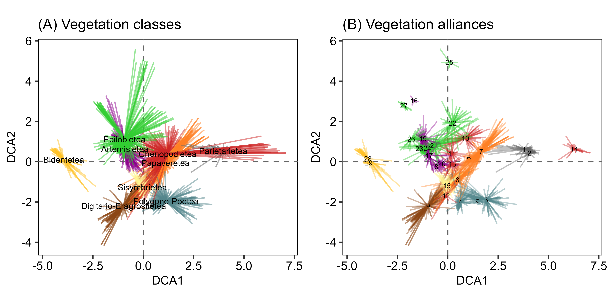
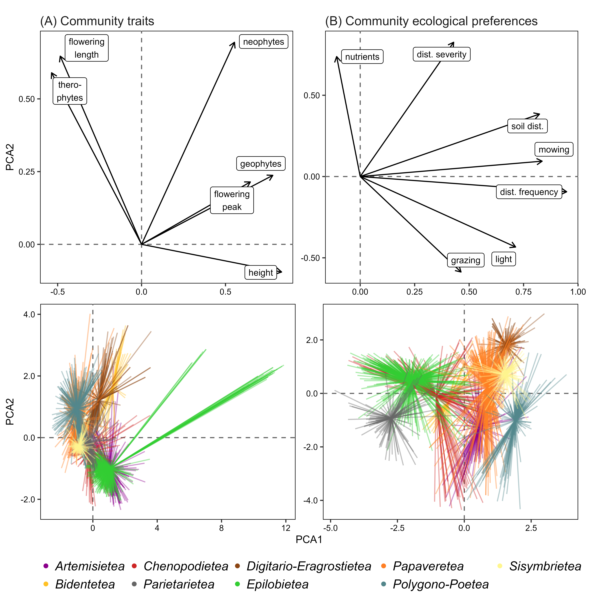
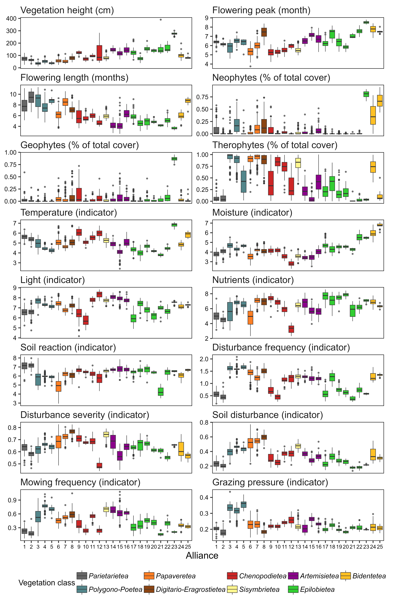
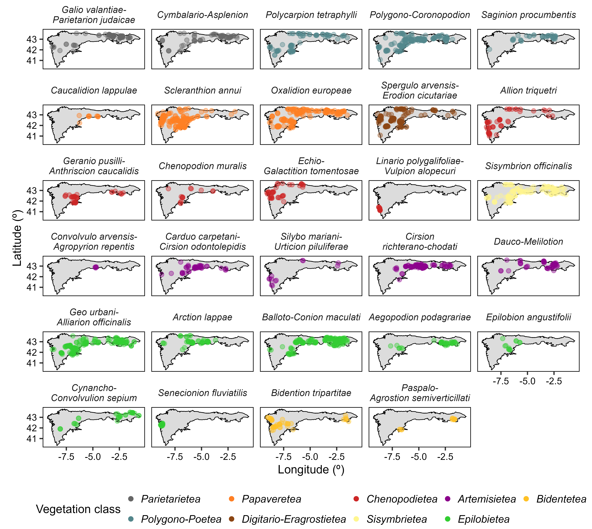

Anthropogenic plant communities of the Iberian Atlantic ecoregion
================

# Methods

We performed all data analyses with R version 4.3.1 ([R Core Team
2023](#ref-RN5387)), using the R package ‘tidyverse’ ([Wickham et al.
2019](#ref-RN4662)) for data processing and visualization. The original
datasets, as well as R code for analysis and creation of the manuscript
can be accessed at the GitHub repository
<https://github.com/efernandezpascual/manmade>.

## Study ecoregion

We studied the anthropogenic plant communities of the Iberian Atlantic
ecoregion, i.e. the territories with a temperate climate in the
north-western Iberian Peninsula. Our study ecoregion broadly corresponds
with the Cantabrian Mixed Forests ecoregion *sensu* Olson *et al.*
([2001](#ref-RN4667)), with the Iberian part of the European Atlantic
province *sensu* Rivas-Martínez *et al.* ([2017](#ref-RN4699)) and with
the Iberian section of the Atlantic biogeographical region of the
European Environmental Agency
(<https://www.eea.europa.eu/data-and-maps/figures/biogeographical-regions-in-europe-2>).
To define in detail the study ecoregion we did a fine-scale revision of
its geographic borders at high spatial resolution using the most recent
biogeographical map of the Iberian Atlantic territories ([Fernández
Prieto et al. 2020](#ref-RN5372)). The revised Iberian Atlantic
ecoregion encompasses 79,891 km2 of Portugal, Spain and
France. Its climate is temperate with average monthly temperatures
ranging from 6 to 20°C, and with total annual precipitation between
1,100 and 2,600 mm, with some areas having warm-dry summers but without
the distinctive 2-month drought of the Mediterranean climate ([Moreno et
al. 1990](#ref-RN5373)). Nonetheless, the Iberian Atlantic ecoregion is
located at the transition between the temperate and the Mediterranean
climates in southern Europe.

## Definition of anthropogenic vegetation

To define our target vegetation, we followed the definitions of
anthropogenic vegetation in the recent classification of the vegetation
of Europe by Mucina *et al.* ([2016](#ref-RN4698)). In our study area,
this potentially includes the vegetation classes *Polygono-Poetea
annuae*, *Papaveretea rhoeadis*, *Digitario sanguinalis-Eragrostietea
minoris*, *Chenopodietea*, *Sisymbrietea*, *Artemisietea vulgaris*,
*Epilobietea angustifolii* and *Bidentetea*. For a complete synthesis,
we added the class *Cymbalario-Parietarietea diffusae* included by
Mucina *et al.* ([2016](#ref-RN4698)) in the vegetation of rock crevices
and screes, since this class encompasses the vegetation of human-made
walls in our ecoregion. For the nomenclature of sintaxa we follow Mucina
*et al.* ([2016](#ref-RN4698)) for alliances and higher ranks, and
Rivas-Martínez *et al.* ([2001](#ref-RN4697)) for associations.

## Vegetation data

As vegetation data for our analyses, we obtained all vegetation relevés
(i.e. records of plant species coexisting in a given sampling plot at a
given date) from our study ecoregion that were available in SIVIM, the
Iberian and Macaronesian Vegetation Information System ([Font et al.
2012](#ref-RN5374)). These were 28,775 relevés representing all
vegetation types (i.e. anthropogenic, semi-natural and natural). Since
these relevés were sampled by different authors throughout the decades,
there was no taxonomical consistency among them, so we homogenized all
taxon names for the whole dataset. We followed the methodology applied
by Jiménez-Alfaro *et al.* ([2021](#ref-RN5375)) to the Cantabrian
Mountains, an area within the study ecoregion which includes c. 80% of
the ecoregional flora, to create a new taxonomical checklist for the
ecoregion based on the Euro+Med Plantbase ([**RN5044?**](#ref-RN5044)).
For vascular plants not included in Euro+Med (e.g. several *Quercus* or
*Salix* hybrids, non-native species, etc.), as well as for bryophytes,
we followed Plants of the World Online ([POWO 2023](#ref-RN5376)). We
removed Fungi and algae. For analytical purposes, we merged taxa into
aggregates (1) when there were sets of very close species with a
difficult identification in the field (e.g. *Viola riviniana* + *V.
reichenbachiana* + *V. sylvestris* = *Viola riviniana* aggr.), (2) when
the taxon was recently separated in different taxa (e.g. *Hedera
helix* + *Hedera hibernica* + *Hedera canariensis* = *Hedera helix*
aggr.) and (3) when it was assumed that not all authors were able to
identify or recognize infraspecific taxa (e.g. all *Narcissus
pseudonarcissus* subspecies and varieties = *Narcissus pseudonarcissus*
aggr.).

For mapping purposes, we improved the geographical information of the
SIVIM relevés using a downscaling procedure. The original position of
vegetation relevés in SIVIM was recorded as 10 km x 10 km (52.2%) and 1
km x 1 km (47.8%) grid cells. We assigned more precise geographic
coordinates to these plots using the elevation recorded originally by
the authors and a digital elevation model (DEM) of the Iberian Peninsula
at 200 m grid resolution. From the original 10 km x 10 km or 1 km x 1 km
grid cell of each relevé, we (1) kept only those 200 m cells that agreed
with the relevé’s elevation (± 50 m); (2) randomly selected one of these
200 m cells; and (3) assigned to the relevé the coordinate of the 200 m
cell’s centroid, in decimal degrees. By doing this, the plots were
downscaled at higher resolution within their cells, assuming that 200 m
cells at similar elevations within the same grid cell also have similar
climatic conditions.

To identify anthropogenic relevés in the SIVIM database we followed two
complementary approaches. Fist, we used the expert system created to
classify vegetation plots into EUNIS pan-European habitat classification
types ([Chytrý et al. 2020](#ref-RN5061)). The expert system uses the
floristic composition of plots to assign them to habitat types depending
on the presence and abundance of characteristic species. We used the
habitats assigned by the expert system to retrieve plots that had been
assigned to any habitat related to the vegetation classes we had
previously defined: all habitats in the level 1 code V (vegetated
man-made habitats), plus level 3 codes R55 (lowland moist or wet
tall-herb and fern fringe) and R57 (herbaceous forest clearing
vegetation). Second, we also retrieved relevés if they had been
classified by the original authors of the relevé into any sintaxa
belonging to our target anthropogenic vegetation classes
(**Supplementary 1**). This produced an initial pool of 3,160 relevés
from SIVIM, to which we added 89 relevés of urban or peri-urban plant
communities conducted by us or extracted by us from the local literature
([Zabaleta Mendizábal 1990](#ref-RN5377); [Uría Arizaga
2020](#ref-RN5378)). After initial exploration of this dataset using
Two-Way Indicator Species Analysis (TWINSPAN) ([Roleček et al.
2009](#ref-RN5379)), we identified 652 outlier relevés which either did
not belong to the target anthropogenic classes or to the geographical
area of the ecoregion. We removed these, leaving a dataset of 2,508
relevés for further analysis: 2,419 relevés from SIVIM, originally
recorded in 89 publications see (**Supplementary 2**); plus 89 relevés
added by us.

## Definition of target alliances and training dataset

As a previous step before classification, we prepared a revised
checklist of potential anthropogenic alliances that could be present in
our study ecoregion, based on regional sintaxonomical checklists ([Izco
et al. 2000](#ref-RN5363); [Díaz González 2020](#ref-RN5008); [Gómez
2020](#ref-RN5365)) and recent revisions at the European level ([Mucina
et al. 2016](#ref-RN4698); [Preislerová et al. 2022](#ref-RN5371)). The
provisional list included 38 alliances.

Then, we filtered our dataset to include only those relevés which had
been assigned by the authors to any of these 38 alliances (n = 2,201
relevés). We used sequential TWINSPANs to do a preliminary
re-classification of the 2,201 filtered relevés, attempting to re-match
the relevés into the *a priori* defined checklist of 38 alliances. We
used 3 pseudospecies cut levels (0, 15, 25) with a minimum group size of
10 plots and Sørensen’s average dissimilarity, and the R package
‘twinspanR’ ([Zelený 2021](#ref-RN5380)) to do the TWINSPANs. To start,
we did a TWINSPAN classification into 15 clusters, followed by separate
TWINSPANS within each cluster. This iterative process allowed us to
validate 28 alliances and assign 1,725 relevés to them, leaving 783
relevés as unclassified.

## Semi-supervised classification

Next, we applied a semi-supervised classification to assign the so far
unclassified relevés to one of the validated 28 alliances.
Semi-supervised classification uses previously defined groups of data to
assign the unclassified relevés to them (as in supervised
classification) but also creates new groups to place the data points
that do not match the already existing groups (as in unsupervised
classification), allowing to detect new groups and to update the
previous classification ([De Cáceres et al. 2010](#ref-RN5383)). We used
the 1,719 relevés that we had already re-classified into the 28
alliances as a training set for the semi-supervised classification.
Attempts by the classification to create new groups resulted on new
groups with no ecological significance, and thus we kept the results of
the classification into the 28 *a priori* alliances. For the
classification, we applied a noise clustering fuzzy algorithm, which
allows the relevés to be classified either into the *a priori* groups or
into a ‘noise’ group which includes outliers and transitional relevés
([Wiser & De Cáceres 2013](#ref-RN5382)). We set the fuzziness
coefficient to a low value (m = 1) to accommodate a high number of
transitional relevés; and we set the distance to the noise class to d
= 1. We performed this analysis with the R package ‘vegclust’ ([De
Cáceres et al. 2010](#ref-RN5383)). The semi-supervised classification
with noise clustering resulted in the final classification of 2,081
relevés into 28 alliances and 427 relevés left in the noise group. We
used pairwise PERMANOVA (with 100,000 iterations, Euclidean distances
and Holm’s p-value correction) fitted with the R package ‘RVAideMemoire’
([Herve 2023](#ref-RN5381)) to detect the maximum number of mutually
different clusters in the filtered dataset; and Detrended Correspondence
Analysis (DCA) as implemented in the R package ‘vegan’ ([Oksanen et al.
2022](#ref-RN5386)) to visualize the relationships between the
vegetation groups.

## Characteristic species

We calculated sets of characteristic species ([Chytrý et al.
2020](#ref-RN5061)) for each of the 28 alliances. We defined dominant
species as species with more than 25% cover in at least 5% of the
relevés of the alliance; constant species as species with a frequency
higher than 50% in the alliance; and diagnostic species as species with
an ‘IndVal’ value with a p-value lower than 0.05, as calculated with the
R package ‘labdsv’ ([Roberts 2016](#ref-RN2311)) using 1.000.000
iterations.

## Community traits and ecological requirements

To describe the resulting 28 alliances, we compiled a dataset of species
traits and ecological preferences for the species pool of the 2,508
classified relevés. For each species, we extracted from *Flora iberica*
([1987](#ref-RN3243)) its maximum height, its median month of flowering,
the length of the flowering period, and whether it was a neophyte or
not. From FloraVeg.EU ([2023](#ref-RN5385)) we extracted the species’
life forms and kept ‘therophyte’ and ‘geophyte’ for further analysis
since these two categories had the largest contribution to variance as
per an exploratory Principal Component Analysis (PCA) performed using
the R package ‘FactoMineR’ ([Lê et al. 2008](#ref-RN3166)). We also
extracted the ecological indicator values ([Dengler et al.
2023](#ref-RN5384)) and the disturbance indicator values ([Midolo et al.
2023](#ref-RN5101)) of each species. In the case of the ecological and
disturbance indicators, we assigned values to species lacking them by
(1) calculating weighted average values of the species with values for
each plot (weighting by species cover), and (2) assigning to the missing
species the weighted average values of the plots where they were present
(weighting by species cover). Then, for each relevé we calculated its
community-weighted mean (weighting by species cover) for each trait and
ecological preference, and explored the main axes of variation using
PCA, separately for species traits and ecological preferences.

# Data availability

The original datasets, as well as R code for analysis and creation of
the manuscript can be accessed at the GitHub repository
<https://github.com/efernandezpascual/manmade>. Upon publication, a
version of record of the repository will be deposited in Zenodo.

# References

Castroviejo, S. 1987. *Flora iberica*. Real Jardín Botánico, CSIC,
Madrid.

Chytrý, M., Tichý, L., Hennekens, S.M., Knollová, I., Janssen, J.A.M.,
Rodwell, J.S., Peterka, T., Marcenò, C., Landucci, F., Danihelka, J.,
Hájek, M., Dengler, J., Novák, P., Zukal, D., Jiménez-Alfaro, B.,
Mucina, L., Abdulhak, S., Aćić, S., Agrillo, E., Attorre, F., Bergmeier,
E., Biurrun, I., Boch, S., Bölöni, J., Bonari, G., Braslavskaya, T.,
Bruelheide, H., Campos, J.A., Čarni, A., Casella, L., Ćuk, M.,
Ćušterevska, R., De Bie, E., Delbosc, P., Demina, O., Didukh, Y., Dítě,
D., Dziuba, T., Ewald, J., Gavilán, R.G., Gégout, J.-C., Giusso del
Galdo, G.P., Golub, V., Goncharova, N., Goral, F., Graf, U., Indreica,
A., Isermann, M., Jandt, U., Jansen, F., Jansen, J., Jašková, A.,
Jiroušek, M., Kącki, Z., Kalníková, V., Kavgacı, A., Khanina, L., Yu.
Korolyuk, A., Kozhevnikova, M., Kuzemko, A., Küzmič, F., Kuznetsov,
O.L., Laiviņš, M., Lavrinenko, I., Lavrinenko, O., Lebedeva, M.,
Lososová, Z., Lysenko, T., Maciejewski, L., Mardari, C., Marinšek, A.,
Napreenko, M.G., Onyshchenko, V., Pérez-Haase, A., Pielech, R.,
Prokhorov, V., Rašomavičius, V., Rodríguez Rojo, M.P., Rūsiņa, S.,
Schrautzer, J., Šibík, J., Šilc, U., Škvorc, Ž., Smagin, V.A., Stančić,
Z., Stanisci, A., Tikhonova, E., Tonteri, T., Uogintas, D., Valachovič,
M., Vassilev, K., Vynokurov, D., Willner, W., Yamalov, S., Evans, D.,
Palitzsch Lund, M., Spyropoulou, R., Tryfon, E., & Schaminée, J.H.J.
2020. [EUNIS habitat classification: Expert system, characteristic
species combinations and distribution maps of european
habitats](https://doi.org/10.1111/avsc.12519). *Applied Vegetation
Science* 23: 648–675.

De Cáceres, M., Font, X., & Oliva, F. 2010. [The management of
vegetation classifications with fuzzy
clustering](https://doi.org/10.1111/j.1654-1103.2010.01211.x). *Journal
of Vegetation Science* 21: 1138–1151.

Dengler, J., Jansen, F., Chusova, O., Hüllbusch, E., Nobis, M.P., Van
Meerbeek, K., Axmanová, I., Bruun, H.H., Chytrý, M., Guarino, R.,
Karrer, G., Moeys, K., Raus, T., Steinbauer, M.J., Tichý, L., Tyler, T.,
Batsatsashvili, K., Bita-Nicolae, C., Didukh, Y., Diekmann, M.,
Englisch, T., Fernández-Pascual, E., Frank, D., Graf, U., Hájek, M.,
Jelaska, S.D., Jiménez-Alfaro, B., Julve, P., Nakhutsrishvili, G.,
Ozinga, W.A., Ruprecht, E.-K., Šilc, U., Theurillat, J.-P., & Gillet, F.
2023. [Ecological indicator values for europe (EIVE)
1.0](https://doi.org/10.3897/vcs.98324). *Vegetation Classification and
Survey* 4:

Díaz González, T.E. 2020. La vegetación del principado de asturias
(españa) (esquema sintaxonómico de las comunidades vegetales). *Boletín
de Ciencias de la Naturaleza del RIDEA* 55: 339–646.

Fernández Prieto, J.A., Amigo, J., Bueno, Á., Herrera, M.,
Rodríguez-Guitián, M.A., & Loidi, J. 2020. Notas sobre el catálogo de
comunidades de plantas vasculares de los territorios iberoatlánticos
(i). *Naturalia Cantabricae* 17–37.

FloraVeg.EU. 2023. FloraVeg.EU – database of european vegetation,
habitats and flora. Www.floraveg.eu. Accessed december 2023.

Font, X., Pérez-García, N., Biurrun, I., Fernández-González, F., &
Lence, C. 2012. The iberian and macaronesian vegetation information
system (SIVIM, www. Sivim. Info), five years of online vegetation’s data
publishing. *Plant Sociology* 49: 89–95.

Gómez, J.A.D. 2020. Sintaxonomía de las comunidades vegetales de
cantabria, 2020. *Flora Montiberica* 56–92.

Herve, M. 2023. RVAideMemoire: Testing and plotting procedures for
biostatistics. R package version 0.9-83-2.
Https://CRAN.r-project.org/package=RVAideMemoire.

Izco, J., Amigo, J., & García-San León, D. 2000. Análisis y
clasificación de la vegetación de galicia (españa), II. La vegetación
herbácea. *Lazaroa* 21:

Jiménez-Alfaro González, F. de B., Carlón, L., Fernández Pascual, E.,
Cires Rodríguez, E., Díaz González, T.E., & Nava Fernández, H.S. 2021.
Checklist of the vascular plants of the cantabrian mountains.
*Mediterranean Botany*

Lê, S., Josse, J., & Husson, F. 2008. FactoMineR: An r package for
multivariate analysis. *Journal of Statistical Software* 25: 1–18.

Midolo, G., Herben, T., Axmanová, I., Marcenò, C., Pätsch, R.,
Bruelheide, H., Karger, D.N., Aćić, S., Bergamini, A., Bergmeier, E.,
Biurrun, I., Bonari, G., Čarni, A., Chiarucci, A., De Sanctis, M.,
Demina, O., Dengler, J., Dziuba, T., Fanelli, G., Garbolino, E., Giusso
del Galdo, G., Goral, F., Güler, B., Hinojos-Mendoza, G., Jansen, F.,
Jiménez-Alfaro, B., Lengyel, A., Lenoir, J., Pérez-Haase, A., Pielech,
R., Prokhorov, V., Rašomavičius, V., Ruprecht, E., Rūsiņa, S., Šilc, U.,
Škvorc, Ž., Stančić, Z., Tatarenko, I., & Chytrý, M. 2023. [Disturbance
indicator values for european
plants](https://doi.org/10.1111/geb.13603). *Global Ecology and
Biogeography* 32: 24–34.

Moreno, J.M., Pineda, F.D., & Rivas‐Martinez, S. 1990. Climate and
vegetation at the eurosiberian‐mediterranean boundary in the iberian
peninsula. *Journal of vegetation science* 1: 233–244.

Mucina, L., Bültmann, H., Dierßen, K., Theurillat, J.-P., Raus, T.,
Čarni, A., Šumberová, K., Willner, W., Dengler, J., García, R.G.,
Chytrý, M., Hájek, M., Di Pietro, R., Iakushenko, D., Pallas, J.,
Daniëls, F.J.A., Bergmeier, E., Santos Guerra, A., Ermakov, N.,
Valachovič, M., Schaminée, J.H.J., Lysenko, T., Didukh, Y.P., Pignatti,
S., Rodwell, J.S., Capelo, J., Weber, H.E., Solomeshch, A., Dimopoulos,
P., Aguiar, C., Hennekens, S.M., & Tichý, L. 2016. [Vegetation of
europe: Hierarchical floristic classification system of vascular plant,
bryophyte, lichen, and algal
communities](https://doi.org/10.1111/avsc.12257). *Applied Vegetation
Science* 19: 3–264.

Oksanen, J., Simpson, G., Blanchet, F., Kindt, R., Legendre, P.,
Minchin, P., O’Hara, R., Solymos, P., Stevens, M., Szoecs, E., Wagner,
H., Barbour, M., Bedward, M., Bolker, B., Borcard, D., Carvalho, G.,
Chirico, M., De Caceres, M., Durand, S., Evangelista, H., FitzJohn, R.,
Friendly, M., Furneaux, B., Hannigan, G., Hill, M., Lahti, L., McGlinn,
D., Ouellette, M., Cunh, E., Smith, T., Stier, S., Ter Braak, C., &
Weedon, J. 2022. Vegan: Community ecology package. R package version
2.6-4. Https://CRAN.r-project.org/package=vegan.

Olson, D.M., Dinerstein, E., Wikramanayake, E.D., Burgess, N.D., Powell,
G.V., Underwood, E.C., D’amico, J.A., Itoua, I., Strand, H.E., &
Morrison, J.C. 2001. Terrestrial ecoregions of the world: A new map of
life on earth: A new global map of terrestrial ecoregions provides an
innovative tool for conserving biodiversity. *BioScience* 51: 933–938.

POWO. 2023. Plants of the world online. Facilitated by the royal botanic
gardens, kew. Published on the internet;
http://www.plantsoftheworldonline.org/ retrieved september 2022.".

Preislerová, Z., Jiménez-Alfaro, B., Mucina, L., Berg, C., Bonari, G.,
Kuzemko, A., Landucci, F., Marcenò, C., Monteiro-Henriques, T., Novák,
P., Vynokurov, D., Bergmeier, E., Dengler, J., Apostolova, I., Bioret,
F., Biurrun, I., Campos, J.A., Capelo, J., Čarni, A., Çoban, S., Csiky,
J., Ćuk, M., Ćušterevska, R., Daniëls, F.J.A., De Sanctis, M., Didukh,
Y., Dítě, D., Fanelli, G., Golovanov, Y., Golub, V., Guarino, R., Hájek,
M., Iakushenko, D., Indreica, A., Jansen, F., Jašková, A., Jiroušek, M.,
Kalníková, V., Kavgacı, A., Kucherov, I., Küzmič, F., Lebedeva, M.,
Loidi, J., Lososová, Z., Lysenko, T., Milanović, Đ., Onyshchenko, V.,
Perrin, G., Peterka, T., Rašomavičius, V., Rodríguez-Rojo, M.P.,
Rodwell, J.S., Rūsiņa, S., Sánchez-Mata, D., Schaminée, J.H.J.,
Semenishchenkov, Y., Shevchenko, N., Šibík, J., Škvorc, Ž., Smagin, V.,
Stešević, D., Stupar, V., Šumberová, K., Theurillat, J.-P., Tikhonova,
E., Tzonev, R., Valachovič, M., Vassilev, K., Willner, W., Yamalov, S.,
Večeřa, M., & Chytrý, M. 2022. [Distribution maps of vegetation
alliances in europe](https://doi.org/10.1111/avsc.12642). *Applied
Vegetation Science* 25: e12642.

R Core Team. 2023. [R: A language and environment for statistical
computing. Version 4.3.1](https://www.r-project.org/).

Rivas-Martínez, S., Fernández-González, F., Loidi, J., Lousã, M., &
Penas, A. 2001. Syntaxonomical checklist of vascular plant communities
of spain and portugal to association level. *Itinera Geobotanica* 14:
5–341.

Rivas-Martínez, S., Penas, Á., González, T.E.D., Cantó, P., Río, S. del,
Costa, J.C., Herrero, L., & Molero, J. 2017. Biogeographic units of the
iberian peninsula and baelaric islands to district level. A concise
synopsis. In *The vegetation of the iberian peninsula*, pp. 131–188.
Springer.

Roberts, D.W. 2016. Labdsv: Ordination and multivariate analysis for
ecology. R package version 1.8-0.

Roleček, J., Tichý, L., Zelený, D., & Chytrý, M. 2009. [Modified
TWINSPAN classification in which the hierarchy respects cluster
heterogeneity](https://doi.org/10.1111/j.1654-1103.2009.01062.x).
*Journal of Vegetation Science* 20: 596–602.

Uría Arizaga, O. 2020. Ensamblaje de comunidades vegetales en parcelas
urbanas abandonadas de asturias. *Trabajo Fin de Máster, Universidad de
Oviedo*

Wickham, H., Averick, M., Bryan, J., Chang, W., McGowan, L., François,
R., Grolemund, G., Hayes, A., Henry, L., & Hester, J. 2019. Welcome to
the tidyverse. *Journal of Open Source Software* 4: 1686.

Wiser, S.K., & De Cáceres, M. 2013. [Updating vegetation
classifications: An example with new zealand’s woody
vegetation](https://doi.org/10.1111/j.1654-1103.2012.01450.x). *Journal
of Vegetation Science* 24: 80–93.

Zabaleta Mendizábal, I. 1990. Flora y vegetación de la felguera
(langreo) y sus alrededores. *Tesina de Licenciatura, Universidad de
Oviedo.*

Zelený, D. 2021. twinspanR: TWo-way INdicator SPecies ANalysis (and its
modified version) in r. R package version 0.22.

# Figures

.

.

.

.

